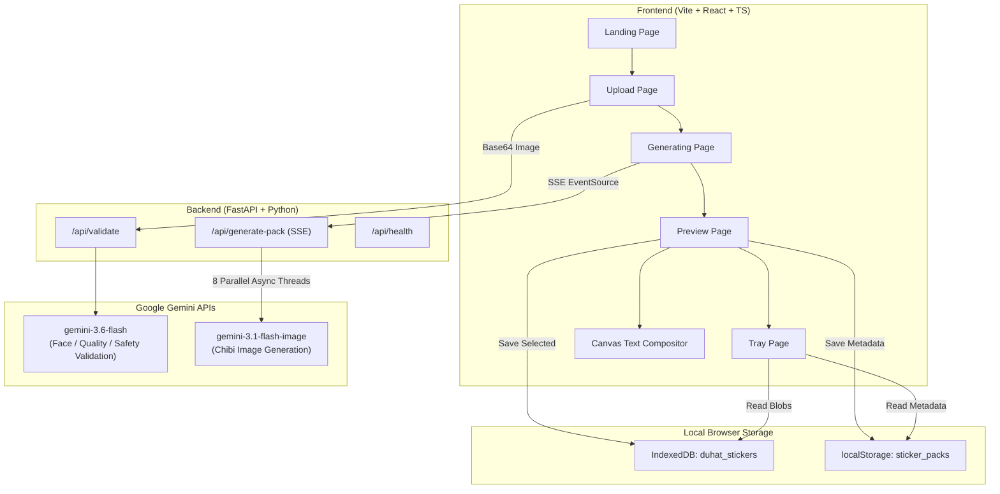

# 🎨 DUHAT AI Sticker Studio — Personalized AI Sticker Generation (V1)

[](https://fastapi.tiangolo.com/)
[](https://react.dev/)
[](https://ai.google.dev/)
[](#)

A full-stack web application that transforms user selfie photos into personalized, high-quality **chibi / kawaii AI sticker packs** for chat applications. Built according to the **DUHAT AI Sticker Generation PRD (V1.0)** specs using Google's native Gemini image generation and vision APIs.

---

## 📸 Key Features

- **📱 Mobile-First Wizard UX**: Clean 5-step wizard (`Landing` → `Upload` → `Generating` → `Preview` → `Tray`).
- **👤 Selfie-to-Chibi Transformation**: Converts a single selfie photo into 8 distinct expressive sticker variants:
  - 😊 **Happy** (Warm Yellow)
  - 😂 **LOL / Laughing** (Bright Orange)
  - 😍 **Love / Heart Eyes** (Pink)
  - 😢 **Sad / Crying** (Soft Blue)
  - 😡 **Angry / Frustrated** (Red)
  - 😲 **Surprised / Shocked** (Purple)
  - 👍 **Thumbs Up / OK** (Green)
  - 😴 **Sleepy / Tired** (Lavender)
- **🤖 Dual-Layer AI Validation**: 
  - *Client-side*: File format (JPEG/PNG/WebP), size limit (10MB), resolution check.
  - *Server-side AI*: Gemini vision (`gemini-3.6-flash`) evaluates face count (exactly 1), face clarity, lighting/blur quality, and content safety.
- **⚡ Parallel Progressive SSE Generation**: Fires 8 concurrent calls to `gemini-3.1-flash-image` via FastAPI SSE stream, showing stickers on the UI as each completes.
- **🔌 Multi-Provider AI Architecture**: Seamlessly switch between **Google Gemini API** (`gemini-3.1-flash-image`), **OpenAI API** (`dall-e-3` / `gpt-4o-mini`), and **Cloudflare Workers AI** (`@cf/black-forest-labs/flux-1-schnell`) via a simple `.env` flag.
- **✂️ Automatic AI Background Removal**: Integrated `rembg` (U-2-Net AI cutout) pipeline that removes backgrounds from raw generated stickers, outputting transparent PNG cutouts ready for chat messaging.
- **🎨 Smart Text Compositing**: Post-generation client-side HTML5 Canvas compositing renders styled, color-coded pill text banners over stickers.
- **🌐 Full i18n (Bilingual)**: Instant language switching between **English (EN)** and **Vietnamese (VI)** for both UI controls and sticker wording.
- **📦 Pack & Sticker Management**: 
  - Save packs directly to browser storage (**IndexedDB** for blobs, `localStorage` for metadata).
  - Download individual PNG stickers or full pack as a `.zip` archive.
  - Delete individual stickers or entire packs.
  - Built-in **Abuse / Content Reporting** modal.
- **🔄 Session Regeneration**: Up to 3 pack regenerations per photo session.

---

## 🏗️ Architecture & Data Flow



---

## 📁 Project Structure

```
duhat_stickergen/
├── PRD_Sticker_Generation_V1.md  # Official Product Requirements Document
├── README.md                     # Project Overview & Setup Guide
├── backend/                      # Python FastAPI Backend
│   ├── .env.example              # Environment variables template
│   ├── main.py                   # FastAPI app entrypoint & SSE router
│   ├── models.py                 # Pydantic schemas (Validation, Generation, Pack)
│   ├── prompts.py                # Chibi character prompts & Gemini validation schema
│   ├── requirements.txt          # Python dependencies
│   ├── validators.py             # Server-side Gemini AI image validation logic
│   └── venv/                     # Python virtual environment
└── frontend/                     # Vite + React (TypeScript) Frontend
    ├── index.html                # App entry HTML & Google Fonts
    ├── package.json              # NPM dependencies (jszip, file-saver, etc.)
    ├── vite.config.ts            # Vite configuration
    └── src/
        ├── App.tsx               # Root app layout & wizard step router
        ├── index.css             # Global design tokens, pastels & animations
        ├── components/           # Reusable UI components
        │   ├── Header.tsx        # App header & branding
        │   ├── LanguageToggle.tsx# EN / VI language switcher
        │   ├── StickerCard.tsx   # Sticker display card with skeleton/selection states
        │   ├── ConsentModal.tsx  # User photo permission modal
        │   └── ReportModal.tsx   # Abuse / content reporting modal
        ├── i18n/                 # Internationalization system
        │   ├── i18n.ts           # i18n helper & context provider
        │   ├── en.json           # English UI & expression labels
        │   └── vi.json           # Vietnamese UI & expression labels
        ├── pages/                # Wizard step pages
        │   ├── LandingPage.tsx   # Hero intro page
        │   ├── UploadPage.tsx    # Drag-and-drop selfie uploader
        │   ├── GeneratingPage.tsx# SSE progress grid loader
        │   ├── PreviewPage.tsx   # Pack selection, compositing & save
        │   └── TrayPage.tsx      # Saved packs manager & ZIP exporter
        ├── services/             # Core application services
        │   ├── api.ts            # REST & SSE backend client
        │   ├── storage.ts        # IndexedDB & localStorage persistence layer
        │   ├── textCompositor.ts # Canvas text overlay builder
        │   └── analytics.ts      # In-memory analytics event tracking
        └── types/
            └── index.ts          # TypeScript domain interfaces & EXPRESSIONS config
```

---

## 🛠️ Prerequisites & Installation

### Requirements
- **Node.js**: `v18.x` or later
- **Python**: `v3.10` or later
- **Gemini API Key**: Valid API Key from [Google AI Studio](https://aistudio.google.com/)

---

## 🚀 How to Run

### 1. Setup Backend (FastAPI)

```bash
cd backend

# Create .env file from template
cp .env.example .env

# Edit .env and select your AI provider:
# Option 1: Google Gemini API (Default)
AI_PROVIDER=gemini
GEMINI_API_KEY=AIzaSy...

# Option 2: Cloudflare Workers AI
# AI_PROVIDER=cloudflare
# CF_ACCOUNT_ID=your_account_id
# CF_API_TOKEN=your_api_token
# CF_IMAGE_MODEL=@cf/black-forest-labs/flux-1-schnell
# CF_VISION_MODEL=@cf/meta/llama-3.2-11b-vision-instruct

# Install dependencies into virtualenv (already set up in venv/)
./venv/bin/pip install -r requirements.txt

# Start FastAPI server on port 8000
./venv/bin/uvicorn main:app --reload --port 8000
```
> Backend runs at: `http://localhost:8000` (Health check: `http://localhost:8000/api/health`)

> [!IMPORTANT]
> **🧠 AI Background Removal Model (`u2net.onnx`) Setup**
> 
> The background removal feature relies on the `u2net.onnx` model (~176MB). Because single files over 100MB cannot be committed directly to GitHub repositories, `backend/.u2net/` is included in `.gitignore`.
> 
> - **Automatic Setup (Default)**: Upon the first sticker generation request, the backend automatically fetches `u2net.onnx` from GitHub releases and saves it into `backend/.u2net/`.
> - **Manual Setup**: If you want to pre-download the model file manually or are working in a restricted network:
>   ```bash
>   mkdir -p backend/.u2net
>   curl -L "https://github.com/danielgatis/rembg/releases/download/v0.0.0/u2net.onnx" -o backend/.u2net/u2net.onnx
>   ```

---

### 2. Setup Frontend (Vite + React)

In a new terminal window:

```bash
cd frontend

# Install Node dependencies (if needed)
npm install

# Start Vite development server
npm run dev
```
> Frontend runs at: `http://localhost:5173`

---

## 📡 API Reference

### `GET /api/health`
Checks API server availability.
- **Response**: `{"status": "ok"}`

---

### `POST /api/validate`
Validates uploaded selfie photo using `gemini-3.6-flash`.
- **Request Body**:
  ```json
  {
    "image_base64": "<base64_encoded_image_string>",
    "mime_type": "image/jpeg"
  }
  ```
- **Response**:
  ```json
  {
    "valid": true,
    "error_code": null,
    "error_message": null,
    "details": {
      "face_count": 1,
      "has_clear_face": true,
      "image_quality": "good",
      "is_safe": true,
      "subject_type": "person"
    }
  }
  ```

---

### `POST /api/generate-pack` (Server-Sent Events)
Generates 8 sticker variants concurrently using `gemini-3.1-flash-image` and streams SSE chunks as each completes.
- **Request Body**:
  ```json
  {
    "image_base64": "<base64_encoded_image_string>",
    "mime_type": "image/jpeg"
  }
  ```
- **SSE Stream Data**:
  ```text
  data: {"expression_id": "happy", "image_base64": "...", "success": true, "filtered": false}

  data: {"expression_id": "laughing", "image_base64": "...", "success": true, "filtered": false}

  ...

  data: {"done": true}
  ```

---

## 🤖 Native Android Application (`android_app/`)

A native Android app built with **Kotlin** & **Jetpack Compose (Material 3)**.

### Android Architecture & Features
- **UI Framework**: 100% Jetpack Compose with Material 3 design tokens.
- **Networking**: `OkHttp 4` + `OkHttp SSE` (Server-Sent Events) for real-time sticker streaming from the FastAPI server (`http://10.0.2.2:8000` / host LAN).
- **Text Overlay Compositing**: Native Android `Canvas`, `Paint`, `Typeface` pill banner rendering.
- **Storage**: Image file storage (`filesDir/stickers/`) + `SharedPreferences` JSON metadata persistence.
- **Image Picker & Camera**: Native Android `ActivityResultContracts` image launcher.
- **i18n Localization**: `I18nManager` state provider supporting instant **EN ↔ VI** UI language toggling.

### 📖 Complete Guide: Building & Running the Android App

#### Step 1: Set Up Java 17 Environment
Ensure `JAVA_HOME` is set to JDK 17 (pre-installed in `$HOME/.local/jdk-17`):
```bash
export JAVA_HOME=$HOME/.local/jdk-17
export PATH=$JAVA_HOME/bin:$PATH
```

#### Step 2: Build the Debug APK
Navigate to `android_app` directory and compile with the Gradle wrapper:
```bash
cd android_app
./gradlew assembleDebug
```
Upon completion, the generated APK file is located at:
`android_app/app/build/outputs/apk/debug/app-debug.apk`

---

#### Step 3: Start the Backend Server
Make sure the FastAPI backend server is active so the Android app can generate stickers:
```bash
cd backend
./start_server.sh
```
*(Or manually run `./venv/bin/uvicorn main:app --reload --host 0.0.0.0 --port 8000`)*

> 💡 **Backend Network Address Configuration**:
> - **Android Emulator**: The app connects to `http://10.0.2.2:8000` by default.
> - **Physical Android Phone**: Tap **⚙️ Server** in the top right header badge (or tap **⚙️ Change Server URL** on the error banner) inside the Android app to enter your computer's LAN IP address (e.g. `http://192.168.1.X:8000`), test the connection, and save! No app re-compilation required.

---

#### Step 4: Install & Launch the App

##### Option A: Using ADB (Command Line)
```bash
# Verify connected emulator or phone
adb devices

# Install APK to device
adb install app/build/outputs/apk/debug/app-debug.apk

# Launch DUHAT AI Sticker Studio
adb shell am start -n com.example.duhatstickerai/.MainActivity
```

##### Option B: Using Android Studio
1. Launch **Android Studio** and click **Open**.
2. Select the `/home/quanld5/Documents/duhat_stickergen/android_app` directory.
3. Wait for Gradle Sync to complete.
4. Select your connected Virtual Device (AVD) or Physical USB Device.
5. Click **Run ▶** (or press `Shift + F10`).

---

## 🧪 Verification & Build Status

- **TypeScript Type Check**: `npx tsc --noEmit` — ✅ Passed (0 errors)
- **Frontend Production Build**: `npx vite build` — ✅ Passed (64 modules transformed)
- **Backend Python Syntax**: `python3 -m py_compile` — ✅ Passed (0 syntax errors)
- **Native Android Gradle Build**: `./gradlew assembleDebug` — ✅ **BUILD SUCCESSFUL** (`app-debug.apk` generated)

---

## 📜 License & Acknowledgements

Designed & developed according to **DUHAT AI Product Specifications (August 2026)**. Powered by Google Gemini Interactions API (`gemini-3.1-flash-image` & `gemini-3.6-flash`).
