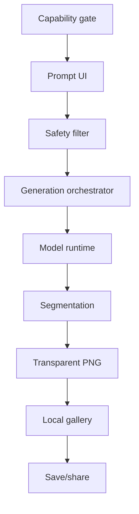

# GenSticker On-Device Architecture

## Document Control

**Purpose:** Define the Android-first target system boundaries and responsibilities for the on-device text-to-sticker release.

**Authority:** [`PRD_AI_Sticker_Generator.md`](./PRD_AI_Sticker_Generator.md), especially its scope, user-flow, system-design, and technology sections. This document is subordinate to the PRD and must be corrected if the two conflict.

**Scope:** The target release architecture. It distinguishes the current repository scaffold from the intended release and does not claim feasibility before the Week 1 spike records evidence in [`FEASIBILITY_SPIKE.md`](./FEASIBILITY_SPIKE.md).

**Last updated:** July 21, 2026

## Architectural Drivers

- Run the core text-to-sticker flow fully on-device after install, with no custom production backend ([PRD § 5 Scope](./PRD_AI_Sticker_Generator.md#5-scope)).
- Ship Android first and support only devices that meet the PRD capability floor ([PRD § 5 Scope](./PRD_AI_Sticker_Generator.md#5-scope)).
- Keep the user-visible pipeline simple: prompt, generation request, generated asset, transparent PNG, preview, save, and share.
- Preserve the fixed five-week delivery window with the PRD contingency plan: Plan A, Plan B, or Plan C is chosen from Week 1 evidence ([PRD § 11 Risk Register & Contingency Plan](./PRD_AI_Sticker_Generator.md#11-risk-register--contingency-plan)).
- Treat input safety, failure recovery, local asset ownership, and native sharing as architecture concerns rather than UI afterthoughts.

## Current Repository State

The current repository contains an Expo/TypeScript mock application with simulated generation and local placeholder assets. An unused FastAPI scaffold remains from an earlier prototype. Neither represents the target release architecture: the mock has no production on-device inference pipeline, and the historical scaffold is not a target release dependency.

## Target System Context

The release is an Android-first application with an Expo/TypeScript app shell and a native on-device inference boundary. The app invokes on-device safety, generation, segmentation, local asset, and platform-sharing capabilities through versioned observable behavior defined in [`INTEGRATION_CONTRACTS.md`](./INTEGRATION_CONTRACTS.md).

The TypeScript application depends on the abstract contract in `INTEGRATION_CONTRACTS.md`; it does not select a concrete inference implementation. The Week 1 feasibility spike chooses the native runtime implementation based on evidence from representative supported devices. The architecture deliberately does not lock MediaPipe Image Generator, or any other candidate runtime, as the production path.

## Component Responsibilities

### App shell

The App shell renders prompt entry, loading, preview, gallery, supported-device messaging, and recovery UI. It owns presentation state and invokes contract-defined operations; it does not embed model-specific behavior.

### Capability gate

The Capability gate evaluates whether the device meets the supported floor and whether required local capabilities are ready. It runs before the generation experience, permits supported devices to continue, and provides the defined unsupported-device state otherwise.

### Safety filter

The Safety filter evaluates the prompt on-device before generation compute starts. It returns an allow or block decision with a safe user-facing outcome and supports the PRD's fixed safety negative prompting through the generation request. It does not perform output-image classification in this release.

### Generation orchestrator

The Generation orchestrator coordinates a permitted generation request, progress stages, cancellation, retries, error mapping, and handoff between the model runtime, segmentation, and asset repository. It isolates each stage so a failure has a recoverable user-visible result rather than destabilizing the application.

### Model runtime

The Model runtime executes the selected on-device generation path and produces a raw image. Its concrete native implementation, model format, delegate configuration, and compatibility rules remain behind the integration contract until the feasibility spike supplies evidence for the selected contingency plan.

### Segmentation

Segmentation converts raw model output into a subject cutout with transparent background. It reports progress stages and recoverable failures to the generation orchestrator, and it is evaluated against stylized output during the feasibility spike.

### Asset repository

The Asset repository owns local generated-asset files and gallery metadata. It creates durable transparent PNG records, makes gallery items available without regeneration, and provides local identifiers to preview, save, and share operations.

### Platform sharing

Platform sharing exposes Android-native save and OS share-sheet operations for a generated asset. It receives only a local asset reference from the contract and leaves asset lifecycle ownership with the asset repository.

## End-to-End Data Flow

The Safety filter may stop a blocked prompt before the Generation orchestrator starts. For an allowed generation request, the orchestrator maps contract-defined progress stages and errors through generation and segmentation, then records the final transparent PNG generated asset in the local gallery for preview and platform sharing.

## Native Boundary

The App shell communicates with the native capabilities through the abstract, versioned contract in [`INTEGRATION_CONTRACTS.md`](./INTEGRATION_CONTRACTS.md). The contract defines generation-request, progress-stage, cancellation, success, failure, model-manifest, generated-asset, and safety-decision behavior without exposing a runtime implementation.

Native code contains platform-specific model execution, segmentation integration, local file handling needed by native APIs, and save/share adapters. The boundary allows the Week 1 spike to evaluate candidate runtimes without forcing UI consumers to depend on a selected runtime's internal API.

## Storage and Asset Lifecycle

Generated assets remain on the device. After segmentation succeeds, the Asset repository persists a transparent PNG and its local metadata as a gallery item. Preview reads that local record; save and share receive a local reference; regeneration creates a distinct asset rather than mutating a prior successful result.

Deletion removes the local gallery metadata and associated local asset according to the privacy and lifecycle rules in [`SAFETY_AND_PRIVACY.md`](./SAFETY_AND_PRIVACY.md). No custom production backend owns generation history, image files, or gallery records.

## Failure Isolation and Recovery

Each pipeline stage reports contract-defined failures independently:

- Capability failures stop entry into generation and show the unsupported-device state.
- Safety blocks show a friendly rejection that does not reveal filter internals.
- Model-runtime failures expose retry, prompt-edit, cancellation, or contingency behavior as defined by the user flow.
- Segmentation failures prevent an incomplete asset from entering the gallery and offer the applicable recovery action.
- Asset persistence and platform-sharing failures preserve an existing successful asset where possible and report a retryable outcome.

Best-effort non-core services must never block the offline generation flow. Failure evidence, recovery behavior, and test coverage are specified in [`TESTING_AND_RELEASE.md`](./TESTING_AND_RELEASE.md).

## Capability Gate

The Capability gate enforces the [PRD's Android device floor](./PRD_AI_Sticker_Generator.md#5-scope): Snapdragon 7-series / Google Tensor G2-equivalent and above, plus runtime readiness required by the selected path. Its user-facing message must make unsupported status clear and must not expose a partial generation experience on devices below that floor.

The gate is a release boundary, not a performance optimization. Device capability criteria, measurement evidence, and the selected Plan A, Plan B, or Plan C remain governed by the PRD, feasibility spike, and roadmap.

## Explicit Non-Goals

The v1 exclusions below implement the [PRD's explicitly out-of-scope release boundaries](./PRD_AI_Sticker_Generator.md#explicitly-out-of-scope-this-release).

- No custom production backend or remote inference dependency for the core generation flow.
- No selfie generation, character profiles, or user-image upload pipeline.
- No sticker fusion or combination generation in this release.
- No iOS release work in this Android-first release.
- No native installable messenger sticker-pack integration; v1 uses native save and OS sharing.
- No output-image moderation or classifier in v1.
- No final native model runtime selection before Week 1 feasibility evidence.

## Related Documents

- [`PRD_AI_Sticker_Generator.md`](./PRD_AI_Sticker_Generator.md) — authoritative scope, constraints, and contingency policy.
- [`INTEGRATION_CONTRACTS.md`](./INTEGRATION_CONTRACTS.md) — versioned application-to-native observable behavior.
- [`FEASIBILITY_SPIKE.md`](./FEASIBILITY_SPIKE.md) — runtime selection evidence and contingency decision.
- [`MODEL_PIPELINE.md`](./MODEL_PIPELINE.md) — offline model preparation and runtime artifact provenance.
- [`SAFETY_AND_PRIVACY.md`](./SAFETY_AND_PRIVACY.md) — safety, local-data, deletion, and telemetry constraints.
- [`USER_FLOWS.md`](./USER_FLOWS.md) — user-visible transitions and recovery behavior.
- [`TESTING_AND_RELEASE.md`](./TESTING_AND_RELEASE.md) — validation evidence and release gates.
- [`ROADMAP.md`](./ROADMAP.md) — implementation status, ownership, blockers, and evidence.
