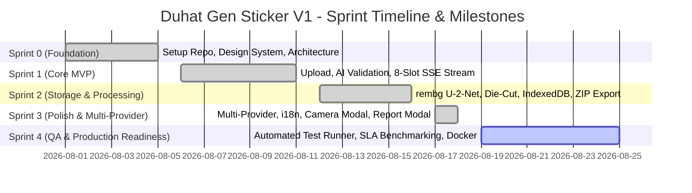

# Danh mục Công việc Triển khai & Kế hoạch Sprint (Implementation Backlog & Sprint Plan) — Duhat Gen Sticker V1

## 0. Kiểm soát tài liệu

| Trường | Giá trị |
| --- | --- |
| Mã tài liệu | PLAN-DGS-V1 |
| Phiên bản | 1.0 |
| Ngày chốt chuẩn | 18/08/2026 |
| Sản phẩm | Duhat Gen Sticker — ứng dụng web full-stack |
| Nguồn sản phẩm bất biến | `PRD_Sticker_Generation_V1_VI.md` |
| Nguồn yêu cầu | `SRS_Sticker_Generation_V1_VI.md` v1.0 |
| Nguồn kiến trúc | `Software_Architecture_Technical_Design.md` v1.0 |
| Nguồn SLA | `SLA_Duhat_Gen_Sticker_V1_VI.md` v1.0 |
| Nguồn kiểm thử | `TDD_Sticker_Generation_V1.md` v1.0 |
| Nguồn bàn giao MVP | `MVP_IMPLEMENTATION_HANDOFF.md` v1.0 |
| Trạng thái | Kế hoạch chuẩn phát triển và bàn giao |

### 0.1 Thứ tự ưu tiên nguồn

1. **PRD** là nguồn sản phẩm gốc và không thay đổi.
2. **SRS** chốt các yêu cầu chức năng, phi chức năng và danh mục quyết định kỹ thuật (DEC-001 đến DEC-017).
3. **Kiến trúc (SAD)** quy định thiết kế cấu trúc module, luồng dữ liệu và tích hợp hệ thống.
4. **SLA** quy định các chỉ số cam kết vận hành và chất lượng sản phẩm.
5. **TDD** quy định các ca kiểm thử và tiêu chuẩn nghiệm thu kỹ thuật.
6. **Kế hoạch này (PLAN)** tổ chức thứ tự thực hiện, phân bổ Sprint, ước lượng khối lượng và theo dõi tiến độ hoàn thành từ MVP đến Production Release.

---

## 1. Tóm tắt Kế hoạch & Mục tiêu V1

### 1.1 Mục tiêu tổng thể

Xây dựng và phát hành ứng dụng web full-stack **Duhat Gen Sticker V1** cho phép người dùng biến một tấm ảnh selfie cá nhân thành bộ 8 sticker Chibi 2D kawaii sinh động, xem trước thời gian thực qua Server-Sent Events (SSE), tự động tách nền phủ viền trắng die-cut, lưu trữ an toàn trong trình duyệt (IndexedDB + localStorage), và xuất tệp PNG / ZIP để sử dụng trong các nền tảng chat.

### 1.2 Nguyên tắc lập kế hoạch

- **Mobile-First & Progressive UX:** Giao diện tối ưu cho thiết bị di động, render progressive ngay khi từng sticker hoàn thành.
- **Privacy-by-Design:** Ảnh gốc chỉ xử lý trong bộ nhớ tạm server (in-memory), không lưu trữ lâu dài; kết quả thuộc quyền sở hữu riêng tư của người dùng tại máy khách.
- **Resilient AI Pipeline:** Hỗ trợ linh hoạt 3 nhà cung cấp AI (Google Gemini, OpenAI, Cloudflare Workers AI) qua biến môi trường `AI_PROVIDER`.
- **Traceability 100%:** Mọi task đều truy vết trực tiếp về yêu cầu SRS và ca kiểm thử TDD tương ứng.

### 1.3 Định nghĩa Sẵn sàng (Definition of Ready - DoR) & Hoàn thành (Definition of Done - DoD)

#### Định nghĩa Sẵn sàng (DoR)
- User Story có mô tả rõ ràng theo cấu trúc: *Là ai... Tôi muốn... Để...*
- Tiêu chí chấp nhận (Acceptance Criteria) được định nghĩa cụ thể theo SRS/PRD.
- Đã xác định ca kiểm thử TDD tương ứng.
- Đã làm rõ các phụ thuộc kỹ thuật (dependencies).

#### Định nghĩa Hoàn thành (DoD)
- Mã nguồn được viết tuân thủ Coding Conventions và TypeScript/Python type safety.
- Đã vượt qua các ca kiểm thử Unit / Integration / API theo TDD.
- Không phát sinh lỗi bảo mật hoặc rò rỉ dữ liệu nhạy cảm (ảnh gốc/API key).
- Đã được kiểm tra thủ công trên trình duyệt máy tính và thiết bị di động.
- Tài liệu liên quan (API/User Guide/Walkthrough) được cập nhật đồng bộ.

---

## 2. Phân chia Epics (Cấu trúc Sản phẩm)

```text
+---------------------------------------------------------------------------------+
|                       DUHAT GEN STICKER V1 PRODUCT EPICS                        |
+---------------------------------------------------------------------------------+
| EPIC-1: Frontend Wizard & Responsive Experience (Landing -> Tray)               |
| EPIC-2: Backend AI Pipelines & SSE Streaming Engine                             |
| EPIC-3: Intelligent Background Removal & Die-Cut Styling Pipeline               |
| EPIC-4: Client-Side Storage & Export Services (IndexedDB / ZIP)                 |
| EPIC-5: Trust, Content Moderation & Privacy Compliance                          |
| EPIC-6: Multi-Provider AI Architecture (Gemini / OpenAI / Cloudflare)           |
| EPIC-7: Quality Assurance, Automated Test Suite & SLA Benchmarking              |
| EPIC-8: Android Shell Wrapper, DevOps & Production Deployment                   |
+---------------------------------------------------------------------------------+
```

---

## 3. Danh mục Chi tiết User Stories & Tasks (Product Backlog)

### EPIC-1: Frontend Wizard & Responsive Experience

| ID | User Story / Công việc | Ước lượng (SP) | Trạng thái | SRS Trace | TDD Trace |
| :--- | :--- | :---: | :---: | :--- | :--- |
| **US-1.1** | **Landing Page & Branding DUHAT:** Thiết kế giao diện mở đầu với linh vật vịt 🐥, nút "Create My Stickers", "My Sticker Tray", và Language Toggle. | 3 | **Đã hoàn thành** | §2.1, AC-001 | `TC-LND-001`..`004` |
| **US-1.2** | **Upload Page & File Picker:** Hỗ trợ kéo thả, chọn file ảnh JPEG/PNG/WebP, kiểm tra dung lượng ≤ 10MB và định dạng ở phía client. | 3 | **Đã hoàn thành** | FR-INP-001, FR-VAL-001 | `TC-UPL-001`..`006` |
| **US-1.3** | **Camera Modal & Face Viewfinder:** Chụp ảnh trực tiếp từ webcam/camera trước với khung căn mặt chuẩn tỉ lệ selfie. | 5 | **Đã hoàn thành** | FR-INP-002, §2.2 | `TC-UPL-007`..`008` |
| **US-1.4** | **Consent Confirmation Modal:** Hiển thị điều khoản xác nhận quyền sở hữu ảnh trước khi tạo sticker, khóa nút Continue khi chưa tick. | 2 | **Đã hoàn thành** | FR-CNS-001..003 | `TC-CNS-001`..`004` |
| **US-1.5** | **Generating Page & Shimmer Skeleton:** Hiển thị lưới 8 slot với skeleton loading, thanh tiến trình "Generating... X of 8", nút Cancel. | 5 | **Đã hoàn thành** | §2.3, FR-GEN-004 | `TC-GEN-002`..`009` |
| **US-1.6** | **Preview Page & Multi-Selection:** Xem lưới 8 sticker đã tạo, chọn/bỏ chọn từng sticker, nút Select All / Deselect All. | 3 | **Đã hoàn thành** | FR-PRV-001, FR-SEL-001..002 | `TC-PRV-001`..`004` |
| **US-1.7** | **Regenerate Flow (Tối đa 3 lần):** Cơ chế tạo lại toàn bộ 8 sticker từ cùng ảnh nguồn, đếm ngược số lượt còn lại và khóa khi hết lượt. | 3 | **Đã hoàn thành** | FR-REG-001..002, DEC-012 | `TC-PRV-005`..`006` |
| **US-1.8** | **Tray Page & Pack Viewer:** Quản lý kho sticker đã lưu theo thứ tự thời gian, hiển thị thumbnail, mở rộng xem chi tiết pack. | 5 | **Đã hoàn thành** | §2.5, FR-SAV-004 | `TC-TRY-001`..`004` |
| **US-1.9** | **Song ngữ EN/VI Tức thì (i18n):** Tích hợp React Context quản lý đa ngôn ngữ, chuyển đổi nhãn UI và tên biểu cảm không cần tải lại trang. | 3 | **Đã hoàn thành** | DEC-011, AC-015 | `TC-I18-001`..`004` |

---

### EPIC-2: Backend AI Pipelines & SSE Streaming Engine

| ID | User Story / Công việc | Ước lượng (SP) | Trạng thái | SRS Trace | TDD Trace |
| :--- | :--- | :---: | :---: | :--- | :--- |
| **US-2.1** | **FastAPI Server Architecture:** Khởi tạo backend FastAPI, CORS middleware, cấu hình môi trường `.env`, định nghĩa Pydantic schemas. | 3 | **Đã hoàn thành** | SAD §2.2 | `TC-API-001` |
| **US-2.2** | **Health Check Endpoint:** Hiện thực `GET /api/health` trả trạng thái hệ thống, nhà cung cấp AI đang hoạt động và danh sách model. | 1 | **Đã hoàn thành** | SRS §6.1, SLA §3.1 | `TC-API-001`, `TC-PRF-010` |
| **US-2.3** | **AI Vision Validation Endpoint:** Hiện thực `POST /api/validate` gửi ảnh tới Vision Model để kiểm tra số lượng mặt, độ rõ, chất lượng, an toàn. | 5 | **Đã hoàn thành** | FR-VAL-002..009 | `TC-VAL-001`..`010`, `TC-API-002`..`005` |
| **US-2.4** | **Parallel Generation Dispatcher:** Khởi chạy 8 tác vụ sinh ảnh bất đồng bộ song song (`asyncio.as_completed`) cho 8 biểu cảm cố định. | 8 | **Đã hoàn thành** | FR-GEN-002..003, DEC-005 | `TC-GEN-001`..`005` |
| **US-2.5** | **SSE Event Streaming Engine:** Truyền dữ liệu dạng `text/event-stream`, phát từng sự kiện sticker khi hoàn thành kèm event kết thúc `{"done": true}`. | 5 | **Đã hoàn thành** | FR-GEN-004, FR-GEN-007, DEC-014 | `TC-API-006`..`008` |
| **US-2.6** | **Chibi Prompt Engineering System:** Xây dựng hệ thống prompt chuyên sâu ép phong cách Chibi 2D vector kawaii, giữ nguyên đặc trưng nhận diện. | 5 | **Đã hoàn thành** | DEC-006, DEC-007, BR-003 | `TC-GEN-005`..`006` |

---

### EPIC-3: Intelligent Background Removal & Die-Cut Styling Pipeline

| ID | User Story / Công việc | Ước lượng (SP) | Trạng thái | SRS Trace | TDD Trace |
| :--- | :--- | :---: | :---: | :--- | :--- |
| **US-3.1** | **rembg U-2-Net Core Integration:** Tích hợp ONNX model `u2net.onnx` để phân đoạn nhân vật tự động, trả ảnh PNG alpha transparent. | 5 | **Đã hoàn thành** | DEC-013, SAD §4.2 | `TC-BGR-001` |
| **US-3.2** | **Interior Alpha Preservation:** Thuật toán bù đắp các lỗ hổng nhân vật bên trong để tránh làm mất vùng mắt, răng hoặc phụ kiện sáng màu. | 5 | **Đã hoàn thành** | SAD §4.2 | `TC-BGR-005` |
| **US-3.3** | **Cutout Validity & Flood Fill Fallback:** Đánh giá tỉ lệ pixel đục [5%, 92%]; kích hoạt thuật toán flood fill dựa trên 4 góc nếu rembg lỗi. | 5 | **Đã hoàn thành** | SAD §4.2 | `TC-BGR-002`, `TC-BGR-006` |
| **US-3.4** | **White Die-Cut Sticker Border:** Thuật toán giãn nở mask (MaxFilter) kết hợp GaussianBlur tạo viền trắng 6–12px chống răng cưa chuẩn sticker. | 5 | **Đã hoàn thành** | DEC-013, SLA §6.1 | `TC-BGR-004` |
| **US-3.5** | **Smart Text Compositing (Client Canvas):** Vẽ banner chữ có màu tương ứng với từng biểu cảm phía client trước khi lưu/xuất file. | 3 | **Đã hoàn thành** | DEC-016, SAD §9.1 | `TC-DL-002` |

---

### EPIC-4: Client-Side Storage & Export Services

| ID | User Story / Công việc | Ước lượng (SP) | Trạng thái | SRS Trace | TDD Trace |
| :--- | :--- | :---: | :---: | :--- | :--- |
| **US-4.1** | **IndexedDB Service Wrapper:** Khởi tạo database `duhat_stickers`, object store `images` để lưu trữ dữ liệu nhị phân (blob/base64) của sticker. | 3 | **Đã hoàn thành** | FR-SAV-003, SAD §5.1 | `TC-SAV-004`, `TC-STR-001`..`002` |
| **US-4.2** | **localStorage Metadata Management:** Quản lý danh sách pack tại `duhat_sticker_packs`, lưu thông tin định danh, ngày tạo và liên kết sticker ID. | 2 | **Đã hoàn thành** | FR-SAV-003, SAD §5.2 | `TC-SAV-003`, `TC-STR-003`..`004` |
| **US-4.3** | **Single Sticker PNG Download:** Bấm menu ⋮ trên sticker để tải ảnh PNG trong suốt độ phân giải 512×512 về máy. | 2 | **Đã hoàn thành** | FR-DL-001, AC-011 | `TC-DL-001` |
| **US-4.4** | **Full Pack ZIP Export:** Tích hợp JSZip + FileSaver.js để nén toàn bộ sticker trong pack thành tệp ZIP tải về trong 1 click. | 3 | **Đã hoàn thành** | FR-DL-002, AC-012 | `TC-DL-002` |
| **US-4.5** | **Delete Sticker & Pack Management:** Xóa từng sticker riêng lẻ hoặc xóa trọn bộ pack với dialog xác nhận bảo đảm an toàn dữ liệu. | 3 | **Đã hoàn thành** | FR-DEL-001..003 | `TC-DEL-001`..`004` |

---

### EPIC-5: Trust, Content Moderation & Privacy Compliance

| ID | User Story / Công việc | Ước lượng (SP) | Trạng thái | SRS Trace | TDD Trace |
| :--- | :--- | :---: | :---: | :--- | :--- |
| **US-5.1** | **Input Safety AI Moderation:** Chặn ảnh chứa nội dung nhạy cảm, bạo lực hoặc không phù hợp ngay tại bước `/api/validate`. | 5 | **Đã hoàn thành** | FR-VAL-003, §7.2 | `TC-SAF-001`..`002` |
| **US-5.2** | **Output Content Filter Handling:** Bắt cờ vi phạm an toàn từ AI generation, đánh dấu slot `filtered: true` và hiển thị cảnh báo an toàn. | 3 | **Đã hoàn thành** | FR-GEN-006, BR-005 | `TC-SAF-003`..`004` |
| **US-5.3** | **Content Reporting Modal:** Cung cấp modal báo cáo 4 danh mục vi phạm (`unauthorized_likeness`, `inappropriate_content`, `copyright_violation`, `other`). | 3 | **Đã hoàn thành** | FR-REP-001..003 | `TC-RPT-001`..`003` |
| **US-5.4** | **Zero-Retention Server Policy:** Bảo đảm server không ghi ảnh nguồn hay ảnh sinh ra vào ổ đĩa bền vững; logs chỉ chứa thông tin kỹ thuật an toàn. | 3 | **Đã hoàn thành** | SAD §7.1, SLA §7.1 | `TC-SAF-006` |
| **US-5.5** | **Anonymous Client Analytics:** Theo dõi các sự kiện vòng đời tạo sticker in-memory phía client mà không đính kèm dữ liệu ảnh nhạy cảm. | 2 | **Đã hoàn thành** | FR-ANL-001..003 | `TC-SAF-007` |

---

### EPIC-6: Multi-Provider AI Architecture

| ID | User Story / Công việc | Ước lượng (SP) | Trạng thái | SRS Trace | TDD Trace |
| :--- | :--- | :---: | :---: | :--- | :--- |
| **US-6.1** | **Google Gemini Adapter:** Tích hợp `gemini-3.6-flash` (Vision validation) và `gemini-3.1-flash-image` (Image generation). | 5 | **Đã hoàn thành** | DEC-008, SAD §3.2 | `TC-MP-001`..`002` |
| **US-6.2** | **OpenAI Adapter:** Tích hợp `gpt-4o-mini` (Vision validation) và `dall-e-3` (Image generation) qua OpenAI API. | 5 | **Đã hoàn thành** | DEC-008, SAD §3.2 | `TC-MP-003`..`004` |
| **US-6.3** | **Cloudflare Workers AI Adapter:** Tích hợp Llama 3.2 Vision và `@cf/black-forest-labs/flux-1-schnell` trên Cloudflare. | 5 | **Đã hoàn thành** | DEC-008, SAD §3.2 | `TC-MP-005`..`006` |
| **US-6.4** | **Dynamic Provider Switching:** Điều phối provider thông qua biến môi trường `AI_PROVIDER` mà không cần sửa đổi mã nguồn frontend. | 3 | **Đã hoàn thành** | SAD §1.2, SAD §3.3 | `TC-MP-007`..`008` |

---

### EPIC-7: Quality Assurance, Automated Test Suite & SLA Benchmarking

| ID | User Story / Công việc | Ước lượng (SP) | Trạng thái | SRS Trace | TDD Trace |
| :--- | :--- | :---: | :---: | :--- | :--- |
| **US-7.1** | **Backend Unit & Integration Test Suite:** Viết bộ test tự động với `pytest` kiểm tra `validators.py`, `bg_remover.py`, `prompts.py`, `main.py`. | 8 | **Đang thực hiện** | TDD §2.1 | `TC-VAL-*`, `TC-BGR-*`, `TC-API-*` |
| **US-7.2** | **Frontend Service Unit Tests:** Viết test `Vitest` cho `storage.ts` (IndexedDB mock), `i18n.ts`, `textCompositor.ts`, `analytics.ts`. | 5 | **Chưa thực hiện** | TDD §2.1 | `TC-STR-*`, `TC-I18-*` |
| **US-7.3** | **E2E Playwright Automation:** Xây dựng kịch bản kiểm thử tự động toàn diện qua 5 bước wizard trên trình duyệt Chromium/WebKit. | 8 | **Chưa thực hiện** | TDD §2.1 | `TC-LND-*` đến `TC-TRY-*` |
| **US-7.4** | **SLA Latency & Concurrency Benchmarking:** Tạo script đo P50/P95 latency của validation, generation và background removal theo SLA. | 5 | **Chưa thực hiện** | SLA §3.2..3.5 | `TC-PRF-001`..`010` |

---

### EPIC-8: Android Shell Wrapper, DevOps & Production Deployment

| ID | User Story / Công việc | Ước lượng (SP) | Trạng thái | SRS Trace | TDD Trace |
| :--- | :--- | :---: | :---: | :--- | :--- |
| **US-8.1** | **Android Native Shell (Jetpack Compose):** Tạo ứng dụng Android bọc WebView, cấu hình xin quyền Camera & Media Storage. | 5 | **Đã hoàn thành** | SAD §2.3 | `TC-MAN-007`..`010` |
| **US-8.2** | **Pre-Built APK Generation:** Build gói phát hành thử nghiệm `duhat-ai-debug.apk` sẵn sàng cài đặt trên thiết bị Android thật. | 3 | **Đã hoàn thành** | HANDOFF §2.1 | `TC-MAN-007` |
| **US-8.3** | **Docker & Containerization:** Đóng gói Backend FastAPI và Frontend Nginx vào Docker Compose phục vụ môi trường staging/production. | 5 | **Chưa thực hiện** | HANDOFF §5 | DevOps Roadmap |
| **US-8.4** | **HTTPS & Production Web Deployment:** Cấu hình SSL/TLS, reverse proxy Nginx cho production để kích hoạt WebRTC/Camera permissions. | 5 | **Chưa thực hiện** | HANDOFF §5 | Security Baseline |
| **US-8.5** | **Rate Limiting & Abuse Prevention:** Tích hợp middleware giới hạn số lượt tạo ảnh (VD: 5 requests/ngày/IP) bảo vệ tài nguyên API. | 5 | **Chưa thực hiện** | HANDOFF §5 | Security Baseline |

---

## 4. Kế hoạch Phân bổ Sprint (Sprint Roadmap)



### Sprint 0: Khởi tạo Nền tảng & Thiết kế Kiến trúc (Hoàn tất)
- **Mục tiêu:** Thiết lập cấu trúc dự án full-stack, tài liệu đặc tả PRD/SRS/SAD/SLA, thiết lập Design System DUHAT.
- **Kết quả bàn giao:** Cấu trúc thư mục `frontend/`, `backend/`, `docs/`, hệ thống design token CSS.

### Sprint 1: Quy trình Cốt lõi & Luồng SSE Streaming (Hoàn tất)
- **Mục tiêu:** Xây dựng luồng tải ảnh, kiểm tra hợp lệ AI Vision, và cơ chế phát sinh ảnh song song qua SSE stream.
- **Kết quả bàn giao:** Landing Page, Upload Page, Consent Modal, FastAPI `/api/validate` & `/api/generate-pack` với Gemini.

### Sprint 2: Xử lý Tách nền, Lưu trữ Client & Xuất tệp (Hoàn tất)
- **Mục tiêu:** Tích hợp pipeline tách nền 4 giai đoạn với rembg và phủ viền trắng die-cut; hoàn thiện lưu trữ IndexedDB và xuất ZIP.
- **Kết quả bàn giao:** `bg_remover.py`, `storage.ts`, Preview Page, Tray Page, chức năng Download PNG & ZIP.

### Sprint 3: Đa nhà cung cấp, Đa ngôn ngữ & Hoàn thiện Trải nghiệm (Hoàn tất)
- **Mục tiêu:** Mở rộng hỗ trợ OpenAI & Cloudflare Workers AI; bổ sung i18n EN/VI, Camera Modal, Report Modal và Android Shell APK.
- **Kết quả bàn giao:** `cloudflare_provider.py`, `openai_provider.py`, `CameraModal.tsx`, `ReportModal.tsx`, `duhat-ai-debug.apk`.

### Sprint 4: Kiểm thử Tự động, Đo kiểm SLA & Sẵn sàng Sản phẩm (Trọng tâm hiện tại)
- **Mục tiêu:** Triển khai runner kiểm thử tự động (pytest + Vitest), đo kiểm thực nghiệm các chỉ số SLA, hoàn thiện Dockerfile.
- **Hạng mục công việc trọng điểm:**
  1. Xây dựng bộ test tự động backend `pytest` bao phủ 100% các ca kiểm thử `TC-VAL-*`, `TC-BGR-*`, `TC-API-*`.
  2. Xây dựng mock test frontend với `Vitest` cho `storage.ts` và `i18n.ts`.
  3. Viết script đo lường P50/P95 latency cho generation và background removal để xác nhận đạt SLA §3.2–§3.5.
  4. Chuẩn bị `Dockerfile` và `docker-compose.yml` cho backend và frontend.

---

## 5. Phân tích Khoảng cách (Gap Analysis) & Kế hoạch Hành động

Dựa trên đối chiếu giữa hiện trạng mã nguồn (`MVP_IMPLEMENTATION_HANDOFF.md`) và yêu cầu hoàn chỉnh (`SRS_Sticker_Generation_V1_VI.md`):

| Hạng mục cần thực hiện | Mức ưu tiên | Tác động kỹ thuật | Kế hoạch hành động chi tiết |
| :--- | :---: | :--- | :--- |
| **Bộ kiểm thử tự động (Automated Test Suite)** | **P1** | Đảm bảo tính ổn định và ngăn ngừa lỗi hồi quy (regression) trước khi release. | Tạo thư mục `backend/tests/` với các file test `test_validators.py`, `test_bg_remover.py`, `test_api.py`. Chạy CI/CD kiểm tra tự động. |
| **Kiểm chuẩn SLA thực nghiệm (SLA Benchmarking)** | **P1** | Đảm bảo hệ thống đạt cam kết P95 ≤ 180s cho generation và P95 ≤ 8s cho validation. | Chạy benchmark script với 20 lượt tạo mẫu, thu thập log thời gian và xuất báo cáo kiểm chuẩn. |
| **Docker hóa Ứng dụng (Containerization)** | **P2** | Giúp việc đóng gói và triển khai môi trường đồng nhất, tự động tải model ONNX. | Viết `backend/Dockerfile` kèm tải sẵn `u2net.onnx` và `frontend/Dockerfile` với Nginx. |
| **Bảo vệ giới hạn tần suất (Rate Limiting)** | **P2** | Tránh lạm dụng chi phí token và tài nguyên hệ thống. | Thêm `slowapi` hoặc Redis rate limiter middleware trên FastAPI backend. |
| **Cấu hình HTTPS Staging** | **P1** | Bắt buộc để trình duyệt cấp quyền Camera API (`getUserMedia`). | Thiết lập reverse proxy Caddy hoặc Nginx có Let's Encrypt SSL. |

---

## 6. Quản lý Rủi ro & Phương án Giảm thiểu (Risk Management)

| Rủi ro kỹ thuật | Mức độ | Khả năng xảy ra | Phương án phòng ngừa & Giảm thiểu |
| :--- | :---: | :---: | :--- |
| **AI Provider bị Rate Limit / Quá tải / Tăng chi phí** | Cao | Trung bình | Kiến trúc Multi-Provider cho phép đổi tức thì sang Cloudflare hoặc OpenAI qua `.env`; giới hạn tối đa 3 lượt regenerate/phiên. |
| **Tải chậm model `u2net.onnx` ở lần đầu khởi động** | Trung bình | Cao | Tự động tải trước (pre-fetch) model trong build step hoặc Dockerfile thay vì tải lúc runtime. |
| **Mất dữ liệu IndexedDB khi người dùng dọn dẹp trình duyệt** | Trung bình | Trung bình | Hiển thị thông báo khuyến khích người dùng xuất ZIP pack về máy để sao lưu vĩnh viễn. |
| **Mất kết nối mạng làm đứt quãng luồng SSE** | Trung bình | Trung bình | Frontend bắt sự kiện disconnect, hiển thị trạng thái thân thiện kèm nút Retry mà không làm mất ảnh nguồn đã chọn. |
| **Tách nền bị lỗi răng cưa hoặc mất chi tiết nhân vật** | Trung bình | Thấp | Pipeline 4 giai đoạn tự động fallback sang Flood Fill và luôn phủ viền trắng die-cut bảo vệ rìa nhân vật. |

---

## 7. Danh sách Kiểm tra Nghiệm thu Phát hành (Release Checklist)

### 7.1 Kiểm tra Môi trường & Cấu hình
- [x] Biến môi trường `.env` mẫu (`.env.example`) được cập nhật đầy đủ.
- [x] Model `u2net.onnx` có sẵn trong thư mục backend hoặc tải tự động thành công.
- [x] Endpoint `GET /api/health` phản hồi mã 200 kèm metadata chính xác.
- [x] CORS cho phép truy cập từ frontend client.

### 7.2 Kiểm tra Trải nghiệm Người dùng
- [x] Hoàn thành luồng 5 bước: Landing → Upload → Generating → Preview → Tray.
- [x] Chụp ảnh trực tiếp từ webcam/camera trước hoạt động chuẩn xác.
- [x] Modal Consent bắt buộc tick trước khi cho phép tạo ảnh.
- [x] Tạo 8 sticker song song qua SSE với hiệu ứng shimmer skeleton và bounce-in.
- [x] Chọn / bỏ chọn sticker trước khi lưu vào IndexedDB.
- [x] Cơ chế tạo lại (Regenerate) hoạt động và khóa chuẩn sau 3 lượt.
- [x] Tải xuống từng ảnh PNG trong suốt và nén toàn bộ pack thành tệp ZIP.
- [x] Xóa sticker đơn và xóa trọn bộ pack trong Tray Page.
- [x] Chuyển đổi ngôn ngữ EN ↔ VI mượt mà trên toàn bộ giao diện.

### 7.3 Kiểm tra An toàn & Chất lượng
- [x] Chặn các nội dung NSFW/bạo lực ngay tại khâu validation.
- [x] Xử lý an toàn khi AI trả cờ filtered, không làm sập toàn bộ bộ sticker.
- [x] Modal Report hoạt động với đầy đủ 4 danh mục vi phạm.
- [x] Server không lưu trữ bất kỳ file ảnh nhạy cảm nào vào ổ đĩa.
- [ ] 100% test cases Critical và High trong TDD đều PASS.
- [ ] Thời gian tạo và độ trễ phản hồi đáp ứng cam kết SLA.