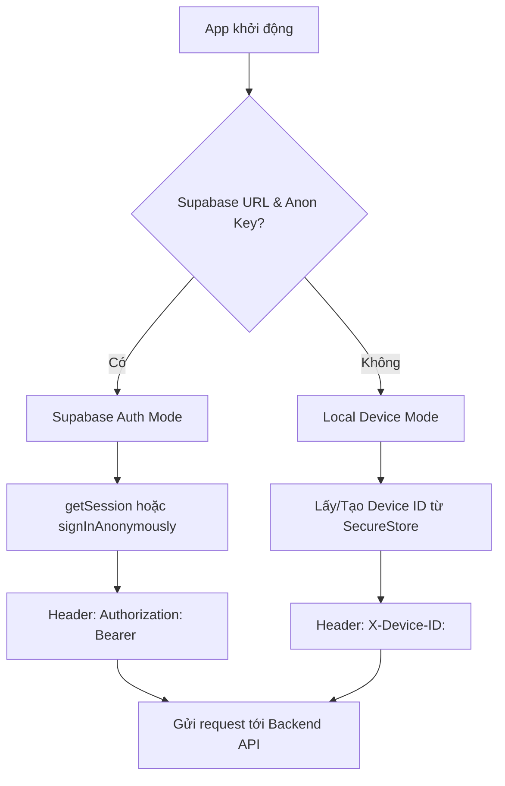
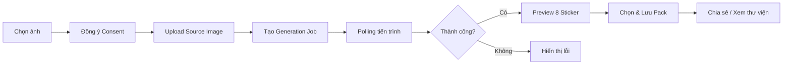
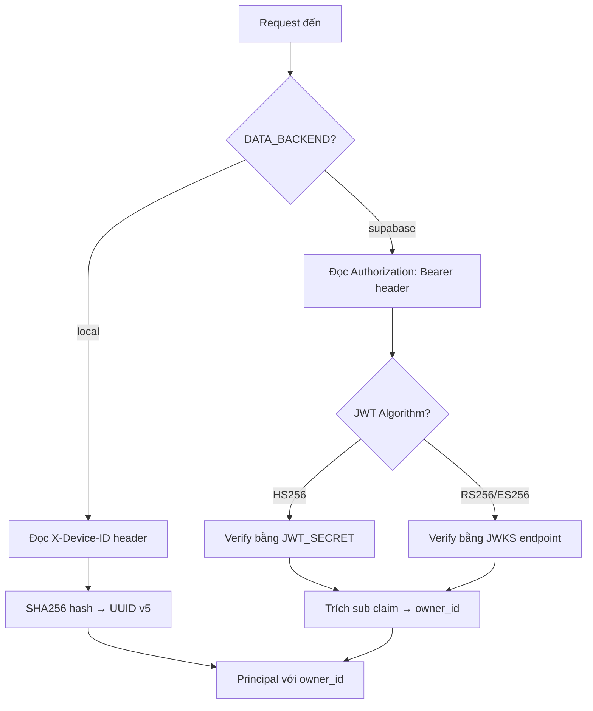
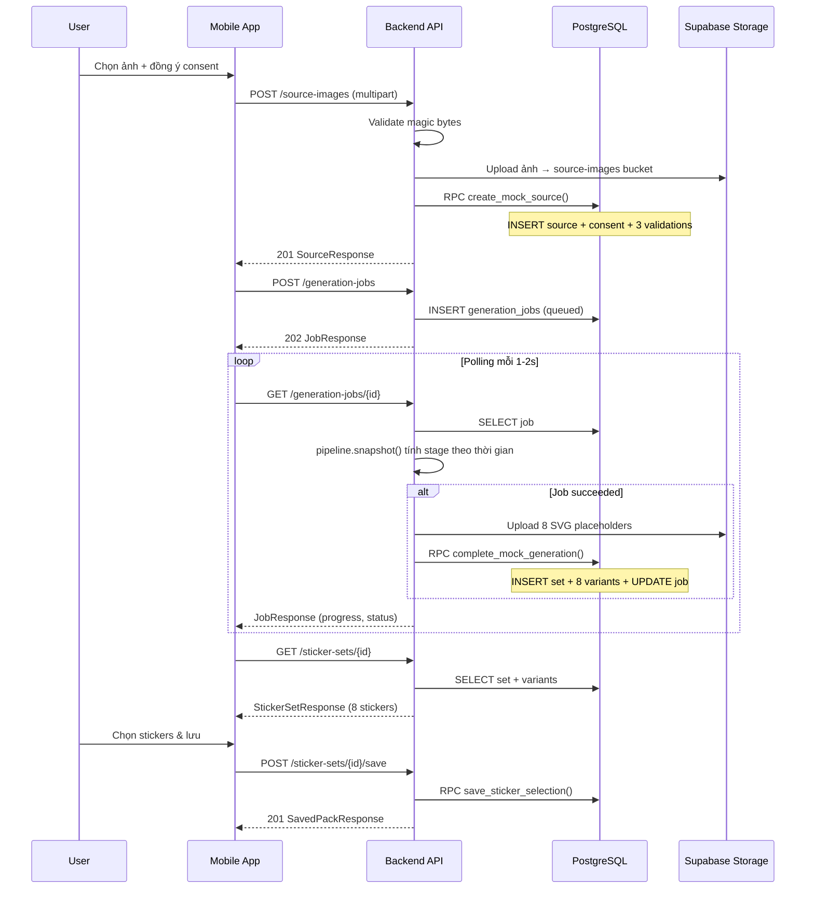

# Software Architecture & Technical Design

**Dự án:** Duhat Gen Sticker MVP  
**Phiên bản:** 1.0.0  
**Ngày cập nhật:** 2026-08-13  

---

## 1. Tổng quan hệ thống

Duhat Gen Sticker là ứng dụng mobile cho phép người dùng tải ảnh chân dung/đồ vật lên, hệ thống sẽ tự động sinh ra bộ 8 sticker phong cách chibi 3D. Người dùng có thể xem trước, chọn lưu và chia sẻ bộ sticker.

### 1.1 Kiến trúc tổng thể

```
┌─────────────────────────────────────────────────────┐
│                   MOBILE CLIENT                     │
│        Expo SDK 54 / React Native 0.81              │
│   ┌───────────┐ ┌───────────┐ ┌──────────────┐     │
│   │  Create    │ │  Jobs     │ │  Library     │     │
│   │  Screen    │ │  Screen   │ │  Screen      │     │
│   └─────┬─────┘ └─────┬─────┘ └──────┬───────┘     │
│         │              │              │             │
│   ┌─────┴──────────────┴──────────────┴───────┐     │
│   │           API Client (Zod validated)      │     │
│   └─────────────────────┬─────────────────────┘     │
│                         │                           │
│   ┌─────────────────────┴─────────────────────┐     │
│   │   Auth (Supabase JWT / X-Device-ID)       │     │
│   └─────────────────────┬─────────────────────┘     │
└─────────────────────────┼───────────────────────────┘
                          │ HTTPS / HTTP
┌─────────────────────────┼───────────────────────────┐
│                   BACKEND API                       │
│              FastAPI (Python 3.12+)                 │
│   ┌─────────────────────┴─────────────────────┐     │
│   │          REST API  /api/v1/*              │     │
│   ├───────────────────────────────────────────┤     │
│   │  Security │ Schemas │ Dependencies        │     │
│   ├───────────────────────────────────────────┤     │
│   │         Repository (Protocol)             │     │
│   │    ┌──────────┐    ┌──────────────┐       │     │
│   │    │  Local    │    │  Supabase    │       │     │
│   │    │  Adapter  │    │  Adapter     │       │     │
│   │    └──────────┘    └──────┬───────┘       │     │
│   ├───────────────────────────┼───────────────┤     │
│   │     Pipeline (Protocol)   │               │     │
│   │    ┌──────────────┐       │               │     │
│   │    │ MockPipeline │       │               │     │
│   │    └──────────────┘       │               │     │
│   └───────────────────────────┼───────────────┘     │
└───────────────────────────────┼─────────────────────┘
                                │
┌───────────────────────────────┼─────────────────────┐
│                     SUPABASE                        │
│   ┌──────────┐  ┌────────────┴──┐  ┌────────────┐  │
│   │ Auth     │  │  PostgreSQL   │  │  Storage   │  │
│   │ (JWT)    │  │  (8 tables)   │  │  (2 bucket)│  │
│   └──────────┘  └───────────────┘  └────────────┘  │
└─────────────────────────────────────────────────────┘
```

### 1.2 Technology Stack

| Layer | Công nghệ | Phiên bản |
|-------|-----------|-----------|
| Mobile | Expo SDK, React Native, TypeScript | 54, 0.81, 5.9 |
| Routing (Mobile) | Expo Router | 6.x |
| State Management | TanStack React Query | 5.x |
| Schema Validation (Mobile) | Zod | 4.x |
| Backend | FastAPI, Uvicorn | 0.115+, 0.30+ |
| Backend Validation | Pydantic, Pydantic-Settings | 2.x |
| Authentication | PyJWT, Supabase Auth | 2.9+ |
| Database | PostgreSQL (Supabase) | 15+ |
| Object Storage | Supabase Storage | — |
| Local Fallback DB | SQLite3 | — |

---

## 2. Mobile Architecture

### 2.1 Cấu trúc thư mục

```
mobile/src/
├── app/                    # Expo Router — file-based routing
│   ├── (tabs)/             # Bottom tab navigation
│   │   ├── index.tsx       # Tab "Tạo mới" (Create)
│   │   └── library.tsx     # Tab "Thư viện" (Library)
│   ├── create.tsx          # Màn hình tạo sticker
│   ├── jobs/               # Theo dõi tiến trình generation
│   ├── preview/            # Xem trước bộ 8 sticker
│   └── packs/              # Chi tiết saved pack
├── api/                    # HTTP client layer
│   ├── client.ts           # API functions (validateSource, createJob, ...)
│   ├── contracts.ts        # Zod schemas & TypeScript types
│   ├── errors.ts           # AppError class & problem+json parsing
│   ├── http.ts             # requestJson / requestEmpty wrappers
│   └── image-upload.ts     # Image MIME detection & upload helpers
├── auth/                   # Authentication
│   ├── auth.ts             # Supabase JWT hoặc X-Device-ID
│   └── secure-store-adapter.ts  # expo-secure-store cho session
├── components/             # Shared UI components
│   ├── sticker-grid.tsx    # Grid hiển thị 8 sticker
│   ├── language-toggle.tsx # Nút chuyển đổi ngôn ngữ
│   └── ui.tsx              # Design system components
├── config/
│   └── env.ts              # Environment variables
├── features/               # Business logic hooks
│   ├── share.ts            # Native sharing
│   └── use-idempotency-key.ts
├── i18n/
│   └── index.tsx           # Đa ngôn ngữ (VI / EN)
├── providers/              # React Context providers
│   ├── active-job.tsx      # Active job state
│   └── app-providers.tsx   # Root provider composition
├── theme/                  # Design tokens
└── utils/                  # Utilities
```

### 2.2 Luồng xác thực (Authentication Flow)



### 2.3 Luồng người dùng chính



---

## 3. Backend Architecture

### 3.1 Cấu trúc thư mục

```
backend/app/
├── main.py             # FastAPI app factory, middleware, exception handlers
├── config.py           # Pydantic Settings — đọc từ .env
├── domain.py           # Domain models (Principal, JobStatus, MockScenario)
├── errors.py           # AppError hierarchy & factory functions
├── schemas.py          # Pydantic response/request models
├── security.py         # Authenticator (JWT / Device-ID)
├── dependencies.py     # FastAPI Depends (get_repository, get_principal)
├── repository.py       # Repository Protocol (interface)
├── pipeline.py         # StickerPipeline Protocol (interface)
├── mock_pipeline.py    # Mock implementation — SVG placeholders
├── adapters/
│   ├── local.py        # SQLite + filesystem adapter
│   └── supabase.py     # Supabase PostgreSQL + Storage adapter
└── api/
    └── routes.py       # REST endpoints /api/v1/*
```

### 3.2 Design Patterns

| Pattern | Áp dụng |
|---------|---------|
| **Repository Pattern** | `Repository` Protocol tách biệt business logic khỏi data access |
| **Strategy Pattern** | `StickerPipeline` Protocol cho phép swap mock ↔ real AI pipeline |
| **Factory Pattern** | `create_app()` trong `main.py` khởi tạo adapter theo config |
| **Dependency Injection** | FastAPI `Depends()` inject repository & principal |
| **Problem+JSON** | Error responses theo RFC 9457 |

### 3.3 API Endpoints

| Method | Endpoint | Mô tả |
|--------|----------|-------|
| `POST` | `/api/v1/source-images` | Upload ảnh nguồn + consent |
| `GET` | `/api/v1/source-images/{id}` | Lấy thông tin ảnh nguồn |
| `POST` | `/api/v1/generation-jobs` | Tạo job sinh sticker |
| `GET` | `/api/v1/generation-jobs` | Danh sách jobs |
| `GET` | `/api/v1/generation-jobs/{id}` | Chi tiết & polling job |
| `POST` | `/api/v1/generation-jobs/{id}/regenerate` | Tạo lại từ job cũ |
| `GET` | `/api/v1/sticker-sets/{id}` | Lấy bộ 8 sticker |
| `POST` | `/api/v1/sticker-sets/{id}/save` | Lưu sticker đã chọn |
| `GET` | `/api/v1/saved-packs` | Danh sách packs đã lưu |
| `GET` | `/api/v1/saved-packs/{id}` | Chi tiết pack |
| `DELETE` | `/api/v1/saved-packs/{id}` | Xóa pack |
| `GET` | `/api/v1/stickers/{id}/asset` | Tải binary sticker |
| `GET` | `/health/live` | Liveness check |
| `GET` | `/health/ready` | Readiness check |

### 3.4 Xác thực Backend



### 3.5 Pipeline Architecture

```
┌──────────────────────────────────┐
│     StickerPipeline (Protocol)   │
│  ┌────────────────────────────┐  │
│  │ mode: str                  │  │
│  │ is_mock: bool              │  │
│  │ output_count: int (=8)     │  │
│  │ snapshot() → JobSnapshot   │  │
│  │ render_placeholder() → bytes│ │
│  └────────────────────────────┘  │
└──────────┬───────────────────────┘
           │
    ┌──────┴──────┐
    │MockPipeline │  ← MVP hiện tại
    │ SVG output  │
    │ Time-based  │
    │  stages     │
    └─────────────┘
```

**Mock Pipeline stages** (mỗi stage = `MOCK_STAGE_SECONDS`):
1. `queued` (0–5%) → 2. `generating` (15–60%) → 3. `moderating` (65–90%) → 4. Terminal (100%)

---

## 4. Database Schema

### 4.1 Entity Relationship Diagram

```mermaid
erDiagram
    auth_users ||--o{ source_images : owns
    auth_users ||--o{ generation_jobs : owns
    auth_users ||--o{ saved_packs : owns

    source_images ||--|| consent_records : has
    source_images ||--o{ validation_results : validated_by
    source_images ||--o{ generation_jobs : generates

    generation_jobs ||--o| sticker_sets : produces
    generation_jobs ||--o| generation_jobs : regenerated_from

    sticker_sets ||--|{ sticker_variants : contains
    sticker_sets ||--o{ saved_packs : saved_as

    saved_packs ||--|{ saved_pack_items : includes
    sticker_variants ||--o{ saved_pack_items : referenced_by

    source_images {
        uuid id PK
        uuid owner_id FK
        text storage_path UK
        text mime_type
        bigint byte_size
        text checksum_sha256
        text status
        timestamptz created_at
    }

    consent_records {
        uuid id PK
        uuid source_image_id FK_UK
        uuid owner_id FK
        text consent_version
        timestamptz accepted_at
    }

    validation_results {
        uuid id PK
        uuid source_image_id FK
        uuid owner_id FK
        text kind
        text status
        text safe_reason_code
        text provider_version
    }

    generation_jobs {
        uuid id PK
        uuid owner_id FK
        uuid source_image_id FK
        uuid regenerated_from_job_id FK
        text status
        text stage
        smallint progress
        text mock_scenario
        text idempotency_key
        text request_hash
    }

    sticker_sets {
        uuid id PK
        uuid owner_id FK
        uuid job_id FK_UK
        text style
        text status
    }

    sticker_variants {
        uuid id PK
        uuid owner_id FK
        uuid set_id FK
        smallint ordinal
        text expression_key
        text storage_path UK
        text mime_type
        text moderation_status
    }

    saved_packs {
        uuid id PK
        uuid owner_id FK
        uuid source_set_id FK
        text title
        text idempotency_key
        text selection_hash
    }

    saved_pack_items {
        uuid pack_id PK_FK
        uuid sticker_id PK_FK
        smallint ordinal
    }
```

### 4.2 Stored Functions (RPC)

| Function | Mô tả | Security |
|----------|--------|----------|
| `create_mock_source()` | Atomic: insert source + consent + 3 validation rows | `SECURITY DEFINER`, chỉ `service_role` |
| `complete_mock_generation()` | Atomic: insert set + 8 variants + update job → succeeded | `SECURITY DEFINER`, chỉ `service_role` |
| `save_sticker_selection()` | Atomic: idempotent save pack + items | `SECURITY DEFINER`, chỉ `service_role` |

### 4.3 Database Constraints

- **Exactly-8 trigger**: Deferred constraint trigger đảm bảo mỗi successful job phải có đúng 8 passed variants
- **Idempotency**: `UNIQUE(owner_id, idempotency_key)` trên `generation_jobs` và `saved_packs`
- **RLS enabled**: Tất cả 8 bảng đều bật Row Level Security, không có policy cho `anon`/`authenticated` — chỉ `service_role` truy cập

### 4.4 Storage Buckets

| Bucket | Mô tả | Public |
|--------|--------|--------|
| `source-images` | Ảnh nguồn upload | **Private** |
| `generated-stickers` | SVG sticker output | **Private** |

Path format: `{owner_id}/{resource_id}/...`

---

## 5. Security Architecture

### 5.1 Nguyên tắc bảo mật

```
┌──────────────┐     Auth Header      ┌───────────────┐
│ Mobile App   │ ──────────────────► │  FastAPI       │
│ (Public)     │                      │  (API Gateway) │
│              │ ◄────────────────── │                │
│ Không có     │    Problem+JSON     │  owner_id      │
│ service key  │                      │  filtering     │
└──────────────┘                      └───────┬───────┘
                                              │ service_role
                                      ┌───────┴───────┐
                                      │  Supabase     │
                                      │  (RLS ON,     │
                                      │   no client   │
                                      │   policies)   │
                                      └───────────────┘
```

| Biện pháp | Chi tiết |
|-----------|----------|
| **API-only boundary** | Mobile không truy cập trực tiếp DB/Storage |
| **Service-role isolation** | Chỉ backend dùng `service_role` key |
| **Owner-scoped queries** | Mọi query đều filter theo `owner_id` |
| **RLS without policies** | Tables có RLS nhưng không có client policies |
| **No storage policies** | Không có `storage.objects` policies |
| **JWT validation** | Hỗ trợ HS256 (legacy) + RS256/ES256 (JWKS) |
| **Content validation** | Magic-byte kiểm tra JPEG/PNG/WebP/HEIC/HEIF |
| **Idempotency keys** | Chống duplicate requests |
| **Problem+JSON errors** | Không leak internal details ra client |
| **Request-ID tracing** | UUID per request cho debugging |

### 5.2 Environment Variable Security

| Variable | Vị trí sử dụng | Lưu ý |
|----------|-----------------|-------|
| `SUPABASE_SERVICE_ROLE_KEY` | Backend only | **KHÔNG** dùng prefix `EXPO_PUBLIC_` |
| `SUPABASE_JWT_SECRET` | Backend only | Chỉ cho HS256 legacy tokens |
| `EXPO_PUBLIC_SUPABASE_ANON_KEY` | Mobile bundle | Anon key — quyền hạn chế |

---

## 6. Data Flow — Tạo Sticker End-to-End



---

## 7. Deployment Architecture

### 7.1 Môi trường Development (Hiện tại)

```
Developer Machine
├── Backend:  uvicorn --reload (port 8000)
├── Mobile:   expo start (Metro port 8081)
├── Database: Supabase Cloud (hosted PostgreSQL)
└── Emulator: Android Emulator (10.0.2.2 → localhost)
```

### 7.2 Cấu hình môi trường

| Biến | Development | Production |
|------|-------------|------------|
| `APP_ENV` | development | production |
| `DATA_BACKEND` | local / supabase | supabase |
| `PIPELINE_BACKEND` | mock | *(real AI adapter)* |
| `ALLOW_LOCAL_DEMO_AUTH` | true | false |

### 7.3 Runtime Safety

- Production **từ chối** khởi động nếu `PIPELINE_BACKEND=mock`
- Production **ẩn** Swagger docs (`/docs` = None)
- Mock failure scenarios chỉ hoạt động trong `development`/`test`

---

## 8. Internationalization (i18n)

- Hỗ trợ: **Tiếng Việt (VI)** 🇻🇳 & **Tiếng Anh (EN)** 🇬🇧
- Toggle ngôn ngữ tức thì qua `LanguageToggle` component
- Quản lý bằng React Context trong `src/i18n/`

---

## 9. Giới hạn MVP & Roadmap

### 9.1 Giới hạn hiện tại

| Hạng mục | Trạng thái MVP |
|----------|----------------|
| AI Pipeline | **Mock** — SVG placeholders, không xử lý ảnh thật |
| Image Moderation | **Mocked** — luôn pass |
| Subject Detection | **Mocked** — không detect thật |
| Style | Chỉ `chibi_3d` (hardcode) |
| Output format | SVG only |
| Sticker count | Cố định 8 |

### 9.2 Các bước tiếp theo (Release Blockers)

1. **Real AI Pipeline**: Implement `StickerPipeline` Protocol với model thật
2. **Content Moderation**: Tích hợp moderation service thật
3. **Subject Validation**: Face/object detection thật
4. **Output Formats**: Hỗ trợ PNG/WebP ngoài SVG
5. **Performance**: Async job queue (Celery/Redis) thay polling
6. **Scaling**: Container deployment (Docker/K8s)

---

## 10. Conventions & Standards

| Quy ước | Chi tiết |
|---------|----------|
| API versioning | URL path prefix `/api/v1/` |
| Error format | RFC 9457 Problem+JSON |
| ID format | UUID v4 |
| Timestamps | ISO 8601 với timezone (UTC) |
| Naming (API) | `snake_case` |
| Naming (Mobile TS) | `camelCase` |
| File encoding | UTF-8 |
| Max upload | 10 MB (configurable) |
