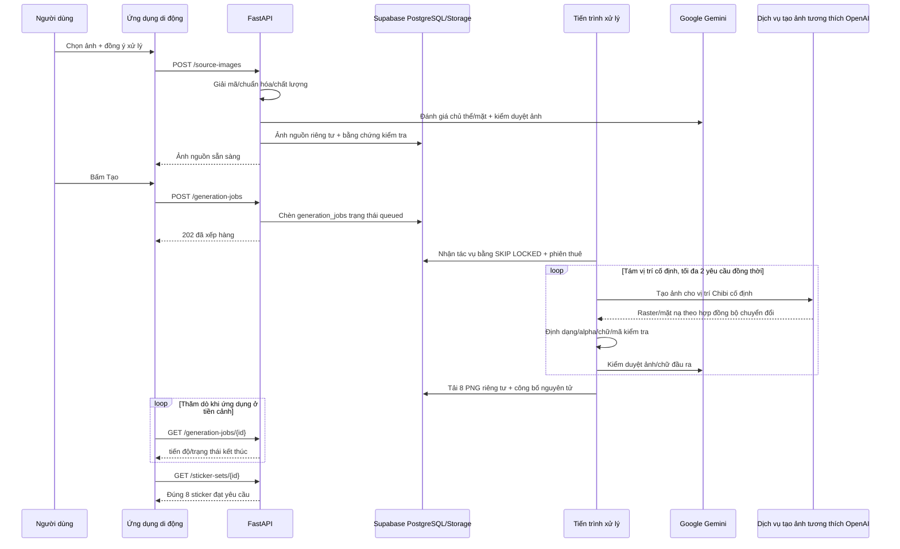

# Thiết kế kiến trúc và kỹ thuật phần mềm — Duhat Gen Sticker V1

## 0. Quy ước tài liệu

| Trường | Giá trị |
| --- | --- |
| Mã | SAD-DGS-V1 |
| Phiên bản | 1.0 |
| Ngày chốt chuẩn | 14/08/2026 |
| Nguồn yêu cầu | `SRS_Sticker_Generation_V1_VI.md` v1.0 |
| Nguồn sản phẩm | Hai PRD bất biến; PRD tiếng Việt là nguồn chính |
| Trạng thái | Kiến trúc mục tiêu đã chốt; các phần triển khai còn thiếu được ghi rõ |

Tài liệu phân biệt:

- **Hiện trạng:** mã nguồn đang tồn tại và có thể chạy/kiểm thử.
- **Mục tiêu V1:** kiến trúc bắt buộc trước khi phát hành theo SRS.

Không được đánh dấu mục tiêu là đã triển khai chỉ vì có mô phỏng hoặc giao diện lập trình sơ bộ.

## 1. Tổng quan kiến trúc

### 1.1 Bối cảnh

```text
+------------------------+  HTTPS/JWT cài đặt    +------------------------+
| Ứng dụng Expo RN       | --------------------> | API FastAPI            |
| Android / iOS          | <-------------------- | Docker trên máy MVP    |
+------------------------+                       +----+---------------+---+
                                                      |               |
                                                      v               v
                                            +----------------+  +----------------+
                                            | Supabase       |  | Google Gemini |
                                            | DB + Storage   |  | Đánh giá/     |
                                            | chỉ lưu trữ    |  | kiểm duyệt    |
                                            +-------+--------+  +-------+--------+
                                                    ^                   ^
                                                    |                   |
                                            +-------+-------------------+---+
                                            | Tiến trình Python            |
                                            | nhận việc từ PostgreSQL      |
                                            +---------------+--------------+
                                                            |
                                                            v
                                            +------------------------------+
                                            | API tạo ảnh tương thích      |
                                            | OpenAI, dịch vụ được cấu hình|
                                            +------------------------------+
```

### 1.2 Nguyên tắc kiến trúc

1. PRD → SRS → Kiến trúc → Bàn giao/Danh sách công việc → TDD.
2. Ứng dụng di động không bao giờ nhận thông tin xác thực nhà cung cấp hoặc khóa bí mật máy chủ Supabase.
3. FastAPI là ranh giới duy nhất để ứng dụng di động truy cập nghiệp vụ/ảnh.
4. Máy chủ không tin MIME, dung lượng, kích thước ảnh, trạng thái đồng ý hoặc ID chủ sở hữu do máy khách gửi.
5. An toàn và đúng 8 ảnh là điều kiện công bố, không phải kiểm tra chỉ ở giao diện.
6. Dữ liệu riêng của nhà cung cấp nằm sau các cổng giao tiếp và không được rò rỉ vào API công khai.
7. Mọi thao tác thay đổi dữ liệu đều lũy đẳng; mọi thực thể người dùng đều gắn với chủ sở hữu.
8. Ảnh nguồn/đầu ra là riêng tư và tồn tại ngắn hạn, trừ khi người dùng chủ động lưu ảnh đầu ra.
9. Môi trường sản xuất đóng an toàn khi dịch vụ an toàn/nhà cung cấp/cấu hình không sẵn sàng.
10. Quy trình mô phỏng và `X-Device-ID` chỉ dùng khi phát triển; tiền sản xuất/sản
    xuất dùng Gemini cùng đúng một dịch vụ tạo ảnh HTTPS tại `OPENAI_BASE_URL`.
11. Supabase chỉ cung cấp PostgreSQL/Storage/sao lưu; không dùng Supabase Auth,
    Queues/PGMQ, Edge Functions hoặc dịch vụ AI của Supabase.

## 2. Ngăn xếp công nghệ

### 2.1 Hiện trạng kho mã nguồn

| Lớp | Công nghệ/phiên bản hiện tại | Trạng thái |
| --- | --- | --- |
| Ứng dụng di động | Expo `~54.0.0`, React Native `0.81.5`, React `19.1.0`, Expo Router `~6.0.24` | Đã triển khai |
| Dữ liệu ứng dụng di động | TanStack Query `^5.101.4`, Zod `^4.4.3` | Đã triển khai |
| Xác thực/trạng thái di động | Supabase JS `^2.112.3`, SecureStore `~15.0.8`, AsyncStorage `2.2.0` | Hiện có; phần Supabase Auth phải thay bằng phiên cài đặt FastAPI |
| Ảnh/chia sẻ trên di động | Expo ImagePicker `~17.0.11`, Image `~3.0.11`, FileSystem `~19.0.23`, Sharing `~14.0.8` | Đã triển khai |
| Máy chủ | Python 3.11+, FastAPI `<1.0`, Pydantic Settings 2.x, Uvicorn | Đã triển khai |
| Xác thực/dữ liệu máy chủ | PyJWT 2.x, Supabase Python 2.x | Hiện có; bộ xác minh JWT Supabase phải thay bằng JWT cài đặt do FastAPI ký |
| Lưu trữ bền vững | Bộ chuyển đổi SQLite/hệ tệp cục bộ; bộ chuyển đổi Supabase PostgreSQL/Storage riêng tư | Đã triển khai; chưa xác minh xong môi trường Supabase |
| Quy trình xử lý | `StickerPipeline` mô phỏng với 8 ảnh giữ chỗ SVG | Chỉ phục vụ bản trình diễn |
| Kiểm thử | Pytest 8.x, Vitest 4.x, Ruff, TypeScript/ESLint | Đã triển khai |

### 2.2 Thành phần phải bổ sung cho Mục tiêu V1

| Năng lực | Công nghệ đã chọn | Lý do/yêu cầu |
| --- | --- | --- |
| Giải mã có thẩm quyền | Pillow 12.x + pillow-heif 1.x | Giải mã toàn bộ, kiểm tra `n_frames`, HEIC/HEIF, hướng ảnh/siêu dữ liệu. |
| Chỉ số điểm ảnh/chất lượng | NumPy 2.x + OpenCV headless 4.x | Kiểm tra Laplacian/độ chói/alpha/tách nền. |
| Tải về thiết bị | `expo-media-library ~18.2.1` | Lưu PNG bằng quyền chỉ thêm vào thư viện hệ điều hành. |
| Danh tính cài đặt | PyJWT 2.x + `installations`/`installation_sessions` trong PostgreSQL | Token truy cập 15 phút, token làm mới băm/xoay vòng 90 ngày; không dùng Supabase Auth. |
| Truy cập PostgreSQL | psycopg 3.x cho giao dịch/phiên thuê; Supabase Python 2.x cho Storage riêng tư | Supabase chỉ là lớp lưu dữ liệu; API/tiến trình xử lý giữ toàn bộ điều phối. |
| Hàng đợi bền vững | Bảng `generation_jobs` + `FOR UPDATE SKIP LOCKED` | Nhận việc/phiên thuê bền vững trong PostgreSQL, không dùng PGMQ/Redis/dịch vụ hàng đợi. |
| Đánh giá chủ thể/khuôn mặt | `InputAssessmentPort` + bộ chuyển đổi Gemini, JSON Schema `input-assessment-v1` | Phân loại người/thú cưng/vật thể, số chủ thể, số mặt nhìn thấy, độ rõ/che khuất; không nhận dạng danh tính hoặc suy luận tuổi. |
| Quyền hình ảnh/sở hữu trí tuệ | `consent-v1.1`, chốt ngữ nghĩa trung lập nhà cung cấp và bảng `reports` trong PostgreSQL | Xác nhận tuổi/quyền bắt buộc; chặn dấu hiệu thương hiệu/bản quyền rõ ràng; người nổi tiếng xử lý qua báo cáo/gỡ bỏ. |
| Tạo ảnh | `GenerationPort` + bộ chuyển đổi API tương thích OpenAI | Dùng URL/khóa/mô hình đã cấu hình; giữ đặc trưng ở mức cao; trả raster có alpha/mặt nạ để chuẩn hóa thành PNG trong suốt 1024×1024. |
| Kiểm duyệt | `OutputAssessmentPort` + bộ chuyển đổi Gemini | Kiểm duyệt ảnh đầu vào và ảnh/chữ đầu ra, chuẩn hóa thành quyết định `blocked`. |
| Chạy dịch vụ máy chủ | Một máy chủ Linux, Docker Compose, cùng một ảnh cho dịch vụ `api` và `worker` | Phù hợp tải MVP; toàn bộ trạng thái bền vững nằm ở Supabase, máy chủ ứng dụng không giữ dữ liệu lâu dài. |
| Bí mật/nhật ký | Biến môi trường từ tệp chỉ chủ máy đọc, nhật ký JSON ra stdout có xoay vòng | Không đưa bí mật vào ảnh/kho mã; không cần dịch vụ quản lý bí mật/nhật ký đám mây riêng trong MVP. |
| Dựng/phát hành ứng dụng di động | EAS Build/Submit, App Store Connect, Google Play Console | Bản dựng gốc có thể tái lập và dữ liệu sự cố theo nền tảng. |

Supabase trong kiến trúc mục tiêu chỉ nhận kết nối máy chủ tới PostgreSQL và
Storage riêng tư. Ứng dụng di động không cài hoặc cấu hình Supabase SDK cho luồng
sản xuất. Xác thực, hàng đợi và xử lý AI đều nằm ngoài Supabase; FastAPI và tiến trình xử lý
Python được đóng gói tối giản trên một máy chủ MVP.

Chuỗi AI có hai bộ chuyển đổi cố định: Gemini cho đánh giá/kiểm duyệt và giao diện
tương thích OpenAI cho tạo ảnh. Bản triển khai không có sổ đăng ký hoặc tệp hồ sơ
nhà cung cấp. Nhóm vận hành đánh giá các dịch vụ tạo ảnh trước phát hành rồi đặt
`OPENAI_BASE_URL`, `OPENAI_API_KEY` và `OPENAI_IMAGE_MODEL` cho đúng một dịch vụ.
Thay URL/mô hình là thay đổi phát hành: phải chạy lại kiểm thử hợp đồng, chất lượng,
độ trễ, an toàn, chi phí và duyệt DPA/quyền riêng tư; không tự động đổi dịch vụ lúc chạy.

### 2.3 Nền tảng cơ sở

Expo SDK 54 tương ứng React Native 0.81/React 19.1, Node 20.19+, Android 7+ với
SDK biên dịch/đích 36 và iOS 15.1+. Mã gói ứng dụng là `vn.duhat.gensticker`.
Màn hình dọc là chính; bố cục máy tính bảng vẫn phải dùng được.

## 3. Thiết kế thành phần

### 3.1 Ứng dụng di động

```text
mobile/src/
├── app/                 # các màn hình Expo Router
│   ├── create.tsx
│   ├── jobs/[id].tsx
│   ├── preview/[id].tsx
│   ├── packs/[id].tsx
│   └── (tabs)/library.tsx
├── api/                 # HTTP, hợp đồng truyền Zod, tải lên/tải xuống
├── auth/                # token truy cập/làm mới của cài đặt trong SecureStore
├── features/            # đồng ý, chia sẻ, tải xuống, phân tích
├── providers/           # nhà cung cấp trạng thái tác vụ/phiên/truy vấn
├── i18n/                # nội dung Việt/Anh và ánh xạ lỗi ổn định
└── utils/               # vòng đời bộ đệm/tính lũy đẳng
```

Trách nhiệm của ứng dụng di động:

- trình chọn ảnh/máy ảnh của hệ thống và khôi phục quyền truy cập;
- xem trước ảnh nguồn, đặt lại sự đồng ý và tải lên theo luồng;
- đăng ký/làm mới phiên cài đặt, xoay token làm mới, tạo khóa lũy đẳng và thử lại an toàn;
- thăm dò/tiếp tục tác vụ, xác nhận bản xem trước đúng 8 ảnh và xử lý lựa chọn;
- liệt kê/xem chi tiết/xóa thư viện;
- tải ảnh tạm có xác thực, lưu bằng MediaLibrary và chia sẻ;
- chỉ gửi dữ liệu phân tích do hệ thống tự quản lý sau khi người dùng đồng ý;
- dọn tệp tạm do ứng dụng sở hữu trong `finally` và khi khởi động.

Ứng dụng di động không được tự đưa ra quyết định có thẩm quyền về an toàn/chủ thể,
truy cập Storage trực tiếp, giữ bí mật máy chủ/nhà cung cấp, ghi URI ảnh vào nhật
ký hoặc tin URL ảnh tùy ý do máy chủ trả về. Ứng dụng dựng lại đường dẫn API chuẩn
từ ID sticker.

### 3.2 API FastAPI

Các mô-đun mục tiêu:

```text
backend/app/
├── api/                 # tuyến, nối phụ thuộc, Problem Details
├── application/         # trường hợp sử dụng/chuyển trạng thái/chính sách
├── domain/              # thực thể/đối tượng giá trị/cổng
├── adapters/
│   ├── local.py              # chỉ phát triển/kiểm thử
│   ├── supabase.py           # PostgreSQL/Storage, không Auth/Queue/AI
│   └── ai/
│       ├── gemini.py         # đánh giá có cấu trúc + kiểm duyệt
│       └── openai_images.py  # tạo ảnh qua API tương thích OpenAI
├── imaging/             # giải mã/chuẩn hóa/kiểm tra chất lượng/đầu ra
├── worker/              # nhận phiên thuê từ generation_jobs/đối soát/dọn dẹp
├── security/            # token cài đặt, chủ sở hữu, giới hạn tần suất, lược bỏ
└── config.py
```

Trách nhiệm của API:

- cấp danh tính cài đặt, băm/xoay token làm mới và xác minh JWT cài đặt; chỉ suy ra chủ sở hữu từ `sub`;
- áp dụng giới hạn dung lượng yêu cầu, tính lũy đẳng, hạn mức, quy tắc tác vụ đang hoạt động và chủ sở hữu;
- thực hiện đồng bộ việc giải mã kỹ thuật, kiểm tra chất lượng và đánh giá đầu vào,
  hoặc trả kết quả từ chối ảnh nguồn cuối cùng trước khi cho tạo tác vụ;
- lưu trạng thái nghiệp vụ; hàng `generation_jobs` ở trạng thái `queued` chính là yêu cầu tạo ảnh bền vững;
- chỉ phục vụ ảnh thuộc chủ sở hữu và đã qua kiểm duyệt với tiêu đề riêng tư/không lưu đệm;
- nhận báo cáo/dữ liệu phân tích trong danh sách cho phép và lập lịch xóa/dọn dẹp;
- công bố trạng thái sống/sẵn sàng mà không lộ bí mật hay chi tiết nhà cung cấp.

### 3.3 Tiến trình xử lý

Vòng đời tiến trình xử lý:

1. Mỗi 2 giây, mở giao dịch PostgreSQL và nhận tác vụ đủ điều kiện bằng
   `FOR UPDATE SKIP LOCKED`; đặt phiên thuê 240 giây rồi cam kết giao dịch.
2. Dừng nếu tác vụ đã kết thúc; đối soát và nhận lại tác vụ chỉ khi phiên thuê cũ đã hết hạn.
3. Xác minh lại ảnh nguồn `ready`, sự đồng ý, thời hạn lưu giữ và phiên bản chính sách.
4. Dựng tám yêu cầu vị trí bất biến bằng `prompt-chibi-v1`.
5. Gọi `GenerationPort` tương thích OpenAI với tối đa 2 yêu cầu đồng thời.
6. Giải mã từng phản hồi; kiểm tra thứ tự, PNG, 1024×1024, RGBA/sRGB, alpha,
   giới hạn 4 MiB và SHA-256.
7. Gọi bộ chuyển đổi Gemini để kiểm duyệt ảnh/chữ đầu ra; tạo bù vị trí không hợp lệ/bị chặn tối đa hai lần.
8. Tải tám PNG riêng tư lên, xác minh mã kiểm tra, sau đó ghi nguyên tử bộ ảnh,
   các biến thể và chuyển tác vụ sang `succeeded`.
9. Khi lỗi/quá thời gian/bị hủy, xóa ảnh ứng viên và kết thúc tác vụ mà không tạo bộ.
10. Chuyển trạng thái kết thúc và xóa các trường phiên thuê trong cùng giao dịch; không có thông điệp hàng đợi riêng để mất đồng bộ.

Tiến trình xử lý gửi tín hiệu sống mỗi 30 giây. Giao thông điệp lặp vẫn an toàn vì
phiên thuê tác vụ, ID lần gọi nhà cung cấp, ràng buộc duy nhất
`(job_id, ordinal, attempt)` và thao tác công bố lũy đẳng ngăn tạo trùng bộ/ảnh.

### 3.4 Bộ chuyển đổi AI

#### Bộ chuyển đổi Gemini

Đầu vào là vùng đệm JPEG/PNG đã chuẩn hóa, không phải ảnh HEIC/WebP thô. Bộ chuyển
đổi gọi Gemini bằng `GEMINI_API_KEY` và bắt buộc trả JSON Schema
`input-assessment-v1`. Hợp đồng chỉ cho phép:

- `subject_type`: `person|pet|object|unknown`;
- `primary_subject_count`: số nguyên không âm;
- `secondary_subject_present`, `assessment_uncertain`: boolean;
- `visible_face_count`, `face_clear`, `face_occluded`, `face_too_small`;
- `obvious_branded_or_copyrighted_character`: boolean.

Câu lệnh hệ thống cấm mô hình nêu hoặc suy đoán tên, danh tính, tuổi và thuộc tính
nhạy cảm của người trong ảnh. Phản hồi thiếu trường, sai enum, từ chối, không chắc
chắn, quá thời gian hoặc lỗi đều đóng an toàn. Bộ chuyển đổi chỉ giữ loại lần gọi,
phiên bản mô hình/lược đồ, ID yêu cầu và quyết định tối thiểu; văn bản/phản hồi thô bị hủy.

Gemini cũng nhận ảnh chuẩn và ảnh/chữ đầu ra để kiểm duyệt. Bộ chuyển đổi ánh xạ
phản hồi thành `blocked`, nhóm lý do nội bộ và phiên bản chính sách. Thiếu trường,
lỗi mạng hoặc bước kiểm duyệt không sẵn sàng đều chặn xử lý. Tên mô hình Gemini,
lược đồ, thời gian chờ và ngưỡng là hằng số có phiên bản trong mã, không nằm trong `.env`.

#### Bộ chuyển đổi tạo ảnh tương thích OpenAI

- Gọi điểm cuối tạo/chỉnh sửa ảnh dưới `OPENAI_BASE_URL` bằng
  `OPENAI_API_KEY` và mô hình `OPENAI_IMAGE_MODEL`; URL bắt buộc dùng HTTPS.
- Tiền tố `OPENAI_` chỉ mô tả giao diện tương thích mà bộ chuyển đổi sử dụng; dịch
  vụ phía sau có thể là nhà cung cấp bên thứ ba đã được nhóm phát hành phê duyệt.
- Ảnh đầu vào và câu lệnh do máy chủ quản lý; yêu cầu ưu tiên giữ đặc trưng/chất
  lượng cao, khung 1024×1024 và nền trong suốt mà không phụ thuộc tên tham số riêng của hãng.
- Ảnh đầu ra phải là raster nhị phân/base64 hoặc raster kèm mặt nạ; bộ chuyển đổi giải mã
  trong bộ nhớ, ghép alpha nếu cần và chuẩn hóa thành PNG RGBA. Không dùng URL công khai của nhà cung cấp.
- Chỉ lưu ID yêu cầu, máy chủ đích không gồm đường dẫn/bí mật, mô hình, phiên bản bộ
  chuyển đổi và chính sách; không lưu câu lệnh/phản hồi thô.
- Lỗi 429/5xx/mạng được thử lại sau 2/5/10 giây trong hạn 180 giây của tác vụ.

### 3.5 Ranh giới cục bộ/mô phỏng

Quy trình mô phỏng hiện tại chỉ có tiến độ và dữ liệu SVG mẫu. Các cổng mục tiêu
thay thế giao diện `snapshot/render_placeholder` vốn được thiết kế theo mô phỏng.
Chế độ cục bộ được giữ cho kiểm thử xác định và bản trình diễn giao diện, phải ghi
rõ là mô phỏng và không được chạy khi
`APP_ENV=staging|production`.

## 4. Quy trình ảnh đầu vào và tạo ảnh

### 4.1 Tải lên và kiểm tra có thẩm quyền

```text
luồng dữ liệu đa phần
 -> tối đa 10 MiB / SHA-256
 -> danh sách MIME + chữ ký tệp cho phép
 -> Pillow/pillow-heif mở, xác minh và tải toàn bộ
 -> n_frames == 1 / không phải chuỗi ảnh
 -> kích thước/tổng điểm ảnh/tỷ lệ
 -> xoay theo EXIF + sRGB 8-bit + loại siêu dữ liệu
 -> chỉ số mờ/sáng bằng OpenCV
 -> kiểm tra đã chấp nhận consent-v1.1 và xác nhận tuổi/quyền
 -> Gemini kiểm tra chủ thể/mặt/dấu hiệu thương hiệu rõ ràng
 -> Gemini kiểm duyệt đầu vào
 -> ghi nguyên tử trạng thái ảnh nguồn ready|rejected
```

Ảnh nguồn thô chỉ được tải vào Storage riêng tư sau bước kiểm tra sớm về dung
lượng/chữ ký. Nếu giải mã lỗi, ảnh bị xóa ngay. Ảnh chuẩn dùng để đánh giá là tệp
tạm và hết hạn trong một giờ. Ảnh nguồn chỉ chuyển `ready` khi mọi kết quả kiểm tra đều đạt.

Kết quả cắt/nén từ ImagePicker được coi là một tệp đầu vào mới và vẫn phải qua
toàn bộ kiểm tra phía máy chủ. Ứng dụng di động không được dựa vào thao tác cắt để
che nhiều chủ thể hoặc biến ảnh động thành ảnh tĩnh được cho phép.

### 4.2 Quyết định chủ thể

Kết quả nghiệp vụ được chuẩn hóa thành `person|pet|object|unknown` và các trường
boolean/số đếm của `input-assessment-v1`. Ảnh chỉ đạt khi có đúng một chủ thể chính,
không có chủ thể thứ hai và kết quả không ở trạng thái không chắc chắn. Ảnh người
còn phải có đúng một khuôn mặt rõ, không bị che hoặc quá nhỏ. Người đi cùng thú
cưng/vật thể được tính là nhiều chủ thể. Bộ đánh giá không nhận dạng danh tính hoặc suy luận tuổi.

### 4.3 Trình tự tạo ảnh



## 5. Thiết kế REST API

### 5.1 Danh mục điểm cuối

| Phương thức | Điểm cuối | Xác thực | Thao tác lũy đẳng | Kết quả thành công |
| --- | --- | --- | --- | --- |
| POST | `/api/v1/installations` | Công khai/giới hạn IP | Khóa yêu cầu | 201 token truy cập/làm mới |
| POST | `/api/v1/installations/refresh` | Token làm mới | Token một lần dùng | 200 cặp token đã xoay |
| POST | `/api/v1/source-images` | JWT cài đặt | Bắt buộc | 201 ảnh nguồn sẵn sàng/bị từ chối |
| GET | `/api/v1/source-images/{id}` | JWT cài đặt/chủ sở hữu | — | 200 |
| POST | `/api/v1/generation-jobs` | JWT cài đặt | Bắt buộc | 202/200 khi phát lại |
| GET | `/api/v1/generation-jobs` | JWT cài đặt/chủ sở hữu | — | 200 trang/danh sách |
| GET | `/api/v1/generation-jobs/{id}` | JWT cài đặt/chủ sở hữu | — | 200 |
| POST | `/api/v1/generation-jobs/{id}/regenerate` | JWT cài đặt/chủ sở hữu | Bắt buộc | 202/200 khi phát lại |
| POST | `/api/v1/generation-jobs/{id}/cancel` | JWT cài đặt/chủ sở hữu | Bắt buộc | 202/200 |
| GET | `/api/v1/sticker-sets/{id}` | JWT cài đặt/chủ sở hữu | — | 200 đúng 8 ảnh |
| POST | `/api/v1/sticker-sets/{id}/save` | JWT cài đặt/chủ sở hữu | Bắt buộc | 201/200 khi phát lại |
| GET | `/api/v1/saved-packs` | JWT cài đặt/chủ sở hữu | — | 200 trang theo con trỏ |
| GET | `/api/v1/saved-packs/{id}` | JWT cài đặt/chủ sở hữu | — | 200 |
| DELETE | `/api/v1/saved-packs/{id}` | JWT cài đặt/chủ sở hữu | Bắt buộc | 204 |
| GET | `/api/v1/stickers/{id}/asset` | JWT cài đặt/chủ sở hữu | — | 200 luồng PNG |
| POST | `/api/v1/reports` | JWT cài đặt/chủ sở hữu | Bắt buộc | 201 |
| GET | `/api/v1/reports/{id}` | JWT cài đặt/chủ sở hữu | — | 200 |
| POST | `/api/v1/analytics/events` | JWT cài đặt | ID lô/sự kiện | 202 |
| GET | `/health/live` | Công khai | — | 200 |
| GET | `/health/ready` | Nội bộ/máy chủ MVP | — | 200/503 |

Truy vấn chéo chủ sở hữu luôn trả 404. Phản hồi lỗi dùng
`application/problem+json` với danh mục lỗi SRS. Con trỏ không để lộ cấu trúc, có
chữ ký và sắp theo `(created_at,id)`; cỡ trang mặc định/tối đa là 20/50.

### 5.2 Phản hồi ảnh

```http
Content-Type: image/png
Content-Disposition: inline; filename="duhat-sticker-{id}.png"
Content-Length: ...
ETag: "sha256-{digest}"
Cache-Control: private, no-store
X-Content-Type-Options: nosniff
```

Máy chủ chỉ đọc Storage riêng tư sau khi kiểm tra chủ sở hữu, trạng thái kiểm duyệt
và chưa bị xóa. Máy chủ không bao giờ trả đường dẫn đối tượng nội bộ hoặc URL có
chữ ký cho ứng dụng di động.

### 5.3 Giới hạn tần suất

- Tạo danh tính cài đặt: 10 lượt/IP/giờ; làm mới token: 60 lượt/IP/giờ. FastAPI/proxy
  áp dụng giới hạn này trước khi ghi PostgreSQL và thu hồi chuỗi token làm mới khi phát hiện phát lại.
- Tải ảnh nguồn: 20 lượt/chủ sở hữu/giờ và 30 lượt/IP/giờ.
- Tạo/tạo lại: 5 lượt/chủ sở hữu/ngày UTC, một tác vụ đang hoạt động.
- API chung: 120 lượt/chủ sở hữu/phút; báo cáo 10 lượt/chủ sở hữu/ngày.
- Khi vượt giới hạn, trả 429 kèm `retry_after_seconds` an toàn.

## 6. Thiết kế lưu trữ bền vững

### 6.1 Các bảng mục tiêu

| Bảng | Trường chính/điều kiện bất biến |
| --- | --- |
| `installations` | UUID chủ sở hữu, trạng thái, `created_at`, `last_seen_at`; không chứa ID thiết bị/phần cứng |
| `installation_sessions` | cài đặt, mã băm token làm mới duy nhất, chuỗi xoay vòng, `expires_at`, `rotated_at`, `revoked_at` |
| `source_images` | chủ sở hữu, đường dẫn riêng tư, MIME/số byte/kích thước/SHA, trạng thái, `expires_at` |
| `consent_records` | ảnh nguồn duy nhất, chủ sở hữu, phiên bản, SHA ảnh nguồn, các xác nhận bắt buộc, `accepted_at`, `retain_until` |
| `validation_results` | ảnh nguồn, loại, trạng thái, điểm/lý do, mô hình Gemini/phiên bản lược đồ/chính sách |
| `generation_jobs` | chủ sở hữu/ảnh nguồn/tác vụ cha/thử lại, trạng thái/giai đoạn/tiến độ, ngôn ngữ/danh mục/phong cách, `generation_base_url_host`, `generation_model`, `available_at`, `lease_owner`, `lease_expires_at`, `heartbeat_at`, `attempt_count`, tham chiếu yêu cầu tạo ảnh |
| `sticker_sets` | chủ sở hữu/tác vụ duy nhất, trạng thái xem trước, số lượng chính xác, `expires_at` |
| `sticker_variants` | chủ sở hữu/bộ, số thứ tự duy nhất 1..8, biểu cảm, hợp đồng PNG, SHA, kiểm duyệt |
| `moderation_decisions` | thực thể, nhà cung cấp/mô hình/chính sách, quyết định/nhóm, `created_at` |
| `provider_invocations` | tác vụ, `provider_kind`, máy chủ đích, mô hình, ID yêu cầu, trạng thái, độ trễ, đơn vị tính phí, `estimated_cost_usd_micros`; không có khóa, ảnh, câu lệnh hoặc phản hồi thô |
| `saved_packs` | chủ sở hữu/bộ nguồn, tiêu đề, `created_at`; chỉ riêng tư |
| `saved_pack_items` | cặp gói/sticker duy nhất, số thứ tự đã lưu |
| `reports` | chủ sở hữu/sticker, lý do/ghi chú/trạng thái/SLA/dấu thời gian kiểm toán |
| `analytics_events` | UUID sự kiện, mã băm chủ sở hữu, lược đồ/phiên bản cho phép, `expires_at` |
| `idempotency_records` | bộ chủ sở hữu/phạm vi/khóa duy nhất, mã băm yêu cầu/kết quả/trạng thái, `expires_at` |
| `deletion_requests` | chủ sở hữu/tài nguyên, trạng thái, `due_at`/`completed_at`/kiểm toán |

Ràng buộc cơ sở dữ liệu bảo đảm mỗi tác vụ thành công chỉ có một bộ, số thứ tự
không trùng, trạng thái hợp lệ, phần lưu qua RPC không rỗng, ghi chú ≤500 ký tự và
ID chủ sở hữu không thay đổi.

### 6.2 Kho lưu trữ đối tượng

| Kho | Công khai | Đối tượng | Thời hạn lưu giữ |
| --- | --- | --- | --- |
| `source-images` | `false` | `{owner}/sources/{source}.{ext}` | 24 giờ sau tác vụ cuối cùng kết thúc |
| `generated-stickers` | `false` | `{owner}/outputs/{set}/{ordinal}-{id}.png` | Bản xem trước 24 giờ; bản đã lưu giữ tới khi xóa |

Giới hạn tải lên/MIME ở cấp kho áp dụng riêng cho ảnh nguồn và đầu ra. Hệ thống
dùng Storage API, không bao giờ sửa trực tiếp `storage.objects`. Mã kiểm tra được
xác minh trước khi công bố vào CSDL và sau khi tải xuống trong kiểm thử tích hợp.

### 6.3 RLS và quyền truy cập dịch vụ

- Bật RLS trên mọi bảng công khai; vai trò `anon`/`authenticated` mặc định không có quyền.
- Ứng dụng di động không nhận Supabase URL/anon key và không có quyền CRUD trên bảng/Storage; ứng dụng chỉ gọi FastAPI.
- Điều kiện chủ sở hữu nằm trong mọi truy vấn FastAPI; RLS từ chối mặc định là lớp phòng thủ khi Data API vô tình bị công bố.
- Bí mật máy chủ của FastAPI/tiến trình xử lý bỏ qua RLS, vì vậy mọi phương thức kho dữ liệu
  đều cần `owner_id` rõ ràng, trừ phương thức vận hành/dọn dẹp đã được kiểm toán.
- Không bật/công bố Supabase Auth, Queues/PGMQ hoặc Edge Functions cho sản phẩm này.

### 6.4 Giao dịch

- Tạo một hàng `generation_jobs` ở trạng thái `queued` là thao tác xếp hàng; không có thông điệp thứ hai.
- Tiến trình xử lý nhận phiên thuê bằng một câu lệnh giao dịch có `FOR UPDATE SKIP LOCKED`; chỉ
  tiến trình giữ đúng `lease_owner` và phiên thuê còn hạn mới được cập nhật bước đang chạy.
- Thao tác lưu kiểm tra các ảnh đã chọn rồi chèn nguyên tử gói/các ảnh.
- Khi công bố thành công, hệ thống tải ảnh ứng viên dưới tiền tố tạm, kiểm tra rồi
  dùng giao dịch CSDL để chèn đúng 8 ảnh và đánh dấu tác vụ thành công; việc sao
  chép/xóa từ tạm sang chính thức được đối soát nếu giao dịch lỗi.
- Thao tác xóa làm tài nguyên mất khả năng truy cập trước; sau đó tiến trình xóa
  loại ảnh khỏi Storage và hoàn tất kiểm toán trong 24 giờ.

## 7. Kiến trúc bảo mật và quyền riêng tư

### 7.1 Xác thực

Lần chạy đầu, ứng dụng gọi `POST /api/v1/installations`. FastAPI tạo UUID cài đặt,
phát JWT truy cập sống 15 phút và token làm mới ngẫu nhiên sống 90 ngày; chỉ mã băm
token làm mới được lưu trong PostgreSQL. Ứng dụng lưu hai token trong SecureStore,
gửi Bearer JWT truy cập và xoay token làm mới qua `/installations/refresh` trước
khi JWT truy cập hết hạn. Token làm mới đã dùng lại làm cả chuỗi phiên bị thu hồi.

FastAPI xác minh thuật toán cho phép, chữ ký, đơn vị phát hành, đối tượng, thời hạn
và UUID `sub` bằng khóa riêng của ứng dụng. `X-Device-ID` chỉ dùng cục bộ; cấu hình
sản xuất phải từ chối nó. Không có mã hoặc cấu hình Supabase Auth ở bản phát hành.

Định danh ẩn danh gắn với thiết bị/phiên: cài lại hoặc đăng xuất sẽ mất quyền truy
cập. Ứng dụng cảnh báo trước khi đặt lại xác thực cục bộ. Liên kết tài khoản và
khôi phục giữa thiết bị nằm ngoài V1.

### 7.2 Biện pháp kiểm soát mối đe dọa

| Mối đe dọa | Biện pháp kiểm soát |
| --- | --- |
| Giả mạo MIME/phần mở rộng | Chữ ký tệp, giải mã toàn bộ, danh sách cho phép và `nosniff`. |
| Bom giải nén | Giới hạn 40 MP/8192, coi cảnh báo Pillow là lỗi, giới hạn bộ nhớ/thời gian xử lý. |
| SVG/tập lệnh/tệp đa nghĩa | Từ chối SVG; định dạng giải mã phải khớp MIME được hỗ trợ đã khai báo. |
| IDOR chéo chủ sở hữu | Điều kiện chủ sở hữu ở mọi phương thức kho dữ liệu, RLS, trả 404 và kiểm thử. |
| Rò rỉ URL đối tượng | API truyền theo luồng; không có URL có chữ ký/đường dẫn trong máy khách/nhật ký/dữ liệu phân tích. |
| Phát lại/trùng chi phí | Tính lũy đẳng, mã băm yêu cầu, hạn mức và một tác vụ đang hoạt động. |
| Rò rỉ dữ liệu qua dịch vụ AI | Chỉ Gemini và máy chủ HTTPS từ `OPENAI_BASE_URL` đã duyệt, có DPA, không huấn luyện, lưu giữ ≤30 ngày, danh sách đích mạng cho phép và kiểm thử lược bỏ. |
| Đầu ra không an toàn/chưa đầy đủ | Kiểm duyệt cả ảnh và chữ, chốt hợp đồng đầu ra và công bố nguyên tử đúng 8 ảnh. |
| Rò rỉ bí mật | Tệp môi trường chỉ chủ máy đọc, bí mật chỉ trong tiến trình máy chủ, lược bỏ/quét nhật ký và luân chuyển 90 ngày. |
| Hai tiến trình nhận cùng tác vụ | `SKIP LOCKED`, phiên thuê có chủ sở hữu, lần thử duy nhất và công bố kết thúc lũy đẳng. |
| Lạm dụng báo cáo | Giới hạn tần suất, chỉ báo cáo ảnh người dùng thấy được và kiểm toán vận hành. |

### 7.3 Tối thiểu hóa dữ liệu

- Loại EXIF/XMP/GPS trước khi gửi nhà cung cấp và tạo ảnh đầu ra.
- Không có câu lệnh người dùng; câu lệnh cố định nằm trong cấu hình máy chủ.
- Gemini và dịch vụ tạo ảnh chỉ nhận ảnh chuẩn cùng dữ liệu tối thiểu cần cho từng bước.
- Không dùng nội dung người dùng ở môi trường sản xuất để huấn luyện/đánh giá mô hình.
- Gemini và dịch vụ tạo ảnh đang cấu hình có DPA, không huấn luyện và lưu giữ tối đa 30 ngày; dự án Supabase đặt tại Singapore.
- Lịch lưu giữ/xóa lấy trực tiếp từ SRS §7.3.

## 8. Triển khai và vận hành

### 8.1 Môi trường

| Môi trường | Dữ liệu | Quy trình xử lý | Xác thực | Mục đích |
| --- | --- | --- | --- | --- |
| cục bộ | SQLite/hệ tệp | mô phỏng xác định | X-Device-ID | Chỉ kiểm thử đơn vị/phát triển/trình diễn |
| kiểm thử | PostgreSQL/Storage Supabase biệt lập | mô phỏng + bộ chuyển đổi giả lập | JWT cài đặt bằng khóa kiểm thử | CI |
| tiền sản xuất | PostgreSQL/Storage Supabase SG riêng | Gemini + điểm cuối tạo ảnh kiểm thử hoặc bộ chuyển đổi giả lập với dữ liệu có kiểm soát | phiên cài đặt FastAPI | Tích hợp/thiết bị/đánh giá chuẩn |
| sản xuất | PostgreSQL/Storage Supabase SG sản xuất | Gemini + đúng một dịch vụ tạo ảnh đã phê duyệt | phiên cài đặt FastAPI | Người dùng cuối |

Không được sao chép dữ liệu sản xuất sang môi trường cục bộ/kiểm thử/tiền sản xuất.

### 8.2 Cấu trúc triển khai MVP

- Một máy chủ Linux tối thiểu 2 vCPU/4 GiB RAM chạy Docker Compose và không giữ trạng thái nghiệp vụ lâu dài.
- Cùng một ảnh máy chủ chạy hai dịch vụ: `api` (một Uvicorn worker) và `worker`
  (một tiến trình nhận phiên thuê từ `generation_jobs`, xử lý tối đa hai tác vụ tạo đồng thời).
- Bộ cân bằng tải, nhiều vùng sẵn sàng và tự co giãn nằm ngoài phạm vi MVP.
- HTTPS do proxy ngược trên máy chủ cung cấp; chỉ công khai cổng 443 và điểm cuối API.
- Tệp môi trường sản xuất thuộc người dùng triển khai, quyền `0600`, không được đưa
  vào ảnh/kho mã/bản sao lưu mã; thay đổi bí mật phải khởi động lại hai dịch vụ.
- Danh sách đích mạng ra ngoài chỉ cho phép máy chủ dự án Supabase, API Gemini và máy chủ lấy từ `OPENAI_BASE_URL`.
- Nhật ký JSON ghi ra stdout, xoay vòng trên máy chủ, giữ 30 ngày và không chứa ảnh,
  đường dẫn đối tượng, token, câu lệnh hoặc phản hồi thô của nhà cung cấp.
- `restart: unless-stopped`, kiểm tra `/health/live` và `/health/ready`; phiên thuê trong
  `generation_jobs` bảo đảm tác vụ được nhận lại sau khi tiến trình hoặc máy chủ khởi động lại.

### 8.3 CI/CD

1. Ruff, Pytest, độ bao phủ và kiểm tra quy tắc tệp chuyển đổi dữ liệu.
2. ESLint, TypeScript, Vitest và kiểm tra phụ thuộc.
3. Dựng ảnh máy chủ; quét phụ thuộc hệ điều hành/Python; tạo SBOM và gắn thẻ bằng SHA bản ghi.
4. Áp dụng chuyển đổi dữ liệu vào môi trường tạm/tiền sản xuất; chạy kiểm thử hợp đồng/tích hợp.
5. Triển khai tiền sản xuất theo mã băm; kiểm tra E2E trên thiết bị và đánh giá chuẩn.
6. Phê duyệt phát hành thủ công; trên máy chủ MVP kéo ảnh đã ghim, chạy chuyển đổi
   tương thích ngược rồi dùng `docker compose up -d` và kiểm tra sức khỏe.
7. Quay lui về thẻ ảnh trước bằng Docker Compose; không quay lui chuyển đổi phá hủy dữ liệu.

EAS dựng ứng dụng di động từ các phụ thuộc đã khóa. Khi gửi lên kho ứng dụng, bản
kê quyền riêng tư/khai báo an toàn dữ liệu của nền tảng phải khớp luồng dữ liệu SRS.

### 8.4 Khả năng quan sát/SLO

Chỉ số: độ trễ/lỗi API, nhóm/số lượng/thời lượng kiểm tra, độ sâu/tuổi hàng đợi,
giai đoạn/độ trễ/kết quả tác vụ, lần thử lại/lỗi 429 của dịch vụ AI, lượt chặn
kiểm duyệt, chi phí trung bình/p95 trên mỗi bộ thành công theo loại dịch vụ/máy chủ/mô hình, lỗi Storage,
TTFB tải xuống và SLA dọn dẹp/xóa. Nhãn chỉ dùng ID yêu
cầu/tác vụ ngẫu nhiên và không được chứa ID chủ sở hữu/ảnh nguồn/sticker.

Cảnh báo tuân theo SRS §9.3. Sao lưu hằng ngày của Supabase và diễn tập khôi phục hằng quý
chứng minh RPO 24 giờ/RTO 8 giờ. Trực báo cáo và cảnh báo xóa quá hạn là điều kiện
quan trọng để phát hành.

## 9. Hợp đồng cấu hình

Khối dưới là toàn bộ cấu hình sản xuất, gồm ứng dụng, Supabase, phiên cài đặt và
AI; chỉ bốn dòng cuối là biến của chuỗi AI.

```text
# Ứng dụng
APP_ENV=production
DATA_BACKEND=supabase
ALLOW_LOCAL_DEMO_AUTH=false

# Supabase — chỉ lưu trữ
SUPABASE_URL=https://<project>.supabase.co
SUPABASE_DB_URL=postgresql://<server-only-connection>
SUPABASE_SERVICE_ROLE_KEY=<secret>
SUPABASE_STORAGE_BUCKET_SOURCE=source-images
SUPABASE_STORAGE_BUCKET_OUTPUT=generated-stickers

# Phiên cài đặt do FastAPI cấp
INSTALLATION_JWT_SIGNING_KEY=<secret-at-least-32-bytes>
INSTALLATION_JWT_ISSUER=duhat-gen-sticker
INSTALLATION_JWT_AUDIENCE=duhat-gen-sticker-mobile
INSTALLATION_ACCESS_TOKEN_TTL_SECONDS=900
INSTALLATION_REFRESH_TOKEN_TTL_SECONDS=7776000

# AI — chỉ bốn biến môi trường
GEMINI_API_KEY=<secret>
OPENAI_API_KEY=<secret>
OPENAI_BASE_URL=https://<approved-provider-host>/v1
OPENAI_IMAGE_MODEL=<provider-image-model>
```

`input-assessment-v1`, giới hạn lưu phía dịch vụ 30 ngày, `consent-v1.1`,
`catalog-chibi-v1`, `prompt-chibi-v1`, mô hình Gemini và các thời gian chờ là hằng
số có phiên bản trong mã/chính sách, không phải cấu hình `.env`.

Kiểm tra khi khởi động từ chối CORS ký tự đại diện, thiếu bất kỳ biến AI nào,
`OPENAI_BASE_URL` không dùng HTTPS, mô phỏng/`X-Device-ID`, kho công khai hoặc
PostgreSQL không hỗ trợ nhận phiên thuê trong tiền sản xuất/sản xuất. Bộ kiểm thử
hợp đồng ở CI/tiền sản xuất xác minh URL/mô hình tạo ảnh thực sự tương thích; kiểm
tra sẵn sàng không ghi khóa, URL đầy đủ hay phản hồi dịch vụ vào nhật ký.

## 10. Bản đồ phần triển khai còn thiếu

| Hạng mục | Hiện trạng | Mục tiêu/hành động |
| --- | --- | --- |
| Tải lên | MIME/chữ ký/10 MiB | Thêm Pillow/pillow-heif để giải mã toàn bộ và kiểm tra khung hình/kích thước/điểm ảnh/siêu dữ liệu. |
| Chủ thể/chất lượng | Kết quả mô phỏng | Hiện thực OpenCV + bộ chuyển đổi Gemini theo `input-assessment-v1`. |
| An toàn/sở hữu trí tuệ/trẻ vị thành niên | Mô phỏng luôn đạt | Hiện thực `consent-v1.1`, kiểm duyệt bằng Gemini, chốt thương hiệu rõ ràng và quy trình báo cáo/gỡ bỏ. |
| Quy trình xử lý | Mô phỏng SVG trong tiến trình API | Tái cấu trúc cổng giao tiếp, tiến trình nhận phiên thuê từ bảng và bộ chuyển đổi tạo PNG tương thích OpenAI. |
| Ảnh đầu ra | Ảnh giữ chỗ SVG | PNG 1024 RGBA trong suốt; kiểm tra mã kiểm tra/chữ/alpha/kiểm duyệt. |
| Kho lưu trữ | Bộ chuyển đổi cục bộ/Supabase | Áp dụng lược đồ/RLS mặc định từ chối, phiên thuê tác vụ, lưu giữ/xóa mục tiêu. |
| Xác thực | Cục bộ hoặc JWT Supabase | Thay bằng danh tính/token cài đặt FastAPI; gỡ Supabase JS/Auth khỏi ứng dụng phát hành. |
| Tải xuống | Máy chủ mới chỉ truyền ảnh | Thêm trải nghiệm lưu bằng Expo MediaLibrary với quyền chỉ thêm, xử lý lỗi và dọn dẹp. |
| Báo cáo | Chưa có | Thêm bảng/API/hàng đợi vận hành/trạng thái báo cáo. |
| Phân tích sản phẩm | Chưa có | Thêm luồng nhận/lưu giữ sự kiện do hệ thống tự quản lý, yêu cầu đồng ý và có danh sách cho phép. |
| Triển khai | Uvicorn cục bộ | Thêm Docker Compose cho API/worker trên một máy chủ MVP, HTTPS, bí mật, nhật ký, CI/CD và diễn tập khôi phục. |

Đây là các công việc triển khai, không phải yêu cầu chưa được quyết định. Kiến
trúc/hợp đồng đã được chốt đầy đủ; trạng thái triển khai được đo qua Danh sách
công việc và TDD.

## 11. Truy vết

| Phạm vi SRS | Kiến trúc |
| --- | --- |
| DEC-002/003/010/020/023 | §1, §2.3, §3.1, §6, §7.1 |
| FR-ENT/INP/CNS | §3.1, §4.1, §7.3 |
| FR-VAL | §2.2, §3.4, §4.1–4.2 |
| FR-GEN/SAFE | §3.2–3.4, §4.3, §6.4 |
| FR-PRV/SEL/REG/SAV/DEL | §3.1, §5, §6 |
| FR-SHR | §3.1, §5.2 |
| FR-REP/ANL | §5.1, §6.1, §8.4 |
| Tác vụ/tính lũy đẳng/lỗi | §3.3, §5, §6.4 |
| Hợp đồng đầu vào/đầu ra | §4, §6.2, §7.2 |
| Bảo mật/quyền riêng tư | §6.3, §7, §9 |
| Hiệu năng/độ sẵn sàng/nền tảng | §2.3, §8 |
| Điều kiện phát hành | §8, §9, §10; được xác minh bằng TDD |

## 12. Tài liệu tham khảo kỹ thuật

- [Expo SDK 54](https://docs.expo.dev/versions/v54.0.0/)
- [Expo ImagePicker](https://docs.expo.dev/versions/v54.0.0/sdk/imagepicker/)
- [Expo MediaLibrary](https://docs.expo.dev/versions/v54.0.0/sdk/media-library/)
- [Supabase RLS](https://supabase.com/docs/guides/database/postgres/row-level-security)
- [Quyền truy cập Supabase Storage](https://supabase.com/docs/guides/storage/security/access-control)
- [PostgreSQL `FOR UPDATE ... SKIP LOCKED`](https://www.postgresql.org/docs/current/sql-select.html#SQL-FOR-UPDATE-SHARE)
- [JWT — RFC 7519](https://www.rfc-editor.org/rfc/rfc7519)
- [Tài liệu tham khảo ảnh Pillow](https://pillow.readthedocs.io/en/stable/reference/Image.html)
- [pillow-heif](https://pillow-heif.readthedocs.io/en/stable/reference/HeifImagePlugin.html)
- [Điểm cuối tạo/chỉnh sửa ảnh OpenAI](https://developers.openai.com/api/docs/models/gpt-image-2) — chỉ dùng làm chuẩn đối chiếu; dịch vụ tương thích bên thứ ba vẫn phải qua kiểm thử hợp đồng.
