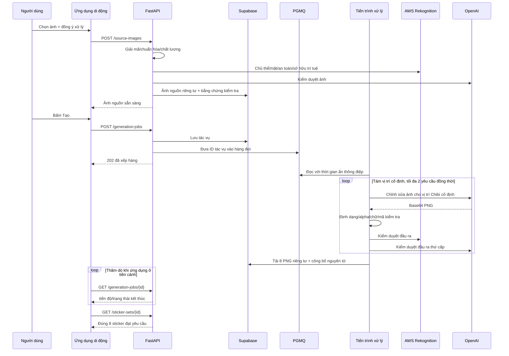

# Thiết kế kiến trúc và kỹ thuật phần mềm — Duhat Gen Sticker V1

## 0. Quy ước tài liệu

| Trường | Giá trị |
| --- | --- |
| Mã | SAD-DGS-V1 |
| Phiên bản | 1.0 |
| Ngày chốt chuẩn | 14/08/2026 |
| Nguồn yêu cầu | `SRS_Sticker_Generation_V1_VI.md` v1.0 |
| Nguồn sản phẩm | Hai PRD bất biến; PRD tiếng Việt là nguồn chính |
| Trạng thái | Kiến trúc mục tiêu đã chốt; các phần triển khai còn thiếu được ghi rõ |

Tài liệu phân biệt:

- **Hiện trạng:** mã nguồn đang tồn tại và có thể chạy/kiểm thử.
- **Mục tiêu V1:** kiến trúc bắt buộc trước khi phát hành theo SRS.

Không được đánh dấu mục tiêu là đã triển khai chỉ vì có mô phỏng hoặc giao diện lập trình sơ bộ.

## 1. Tổng quan kiến trúc

### 1.1 Bối cảnh

```text
+------------------------+       HTTPS/JWT       +------------------------+
| Ứng dụng Expo RN       | --------------------> | API FastAPI trên ECS   |
| Android / iOS          | <-------------------- | xác thực/chính sách/ảnh|
+------------------------+                       +-----------+------------+
                                                               |
                                 +-----------------------------+--------------------+
                                 |                             |                    |
                                 v                             v                    v
                       +-------------------+         +-------------------+  +------------------+
                       | Supabase Singapore|         | PGMQ tạo ảnh      |  | AWS Rekognition  |
                       | Auth/PG/Storage   |         | hàng đợi          |  | ap-southeast-1   |
                       +---------+---------+         +---------+---------+  +------------------+
                                 ^                             |
                                 |                             v
                                 |                   +-------------------+
                                 +-------------------| Xử lý trên ECS    |
                                                     | giải mã/tạo/      |
                                                     | duyệt/công bố     |
                                                     +---------+---------+
                                                               |
                                                               v
                                                     +-------------------+
                                                     | OpenAI chính thức |
                                                     | Ảnh/Kiểm duyệt    |
                                                     +-------------------+
```

### 1.2 Nguyên tắc kiến trúc

1. PRD → SRS → Kiến trúc → Bàn giao/Danh sách công việc → TDD.
2. Ứng dụng di động không bao giờ nhận thông tin xác thực nhà cung cấp hoặc khóa bí mật máy chủ Supabase.
3. FastAPI là ranh giới duy nhất để ứng dụng di động truy cập nghiệp vụ/ảnh.
4. Máy chủ không tin MIME, dung lượng, kích thước ảnh, trạng thái đồng ý hoặc ID chủ sở hữu do máy khách gửi.
5. An toàn và đúng 8 ảnh là điều kiện công bố, không phải kiểm tra chỉ ở giao diện.
6. Dữ liệu riêng của nhà cung cấp nằm sau các cổng giao tiếp và không được rò rỉ vào API công khai.
7. Mọi thao tác thay đổi dữ liệu đều lũy đẳng; mọi thực thể người dùng đều gắn với chủ sở hữu.
8. Ảnh nguồn/đầu ra là riêng tư và tồn tại ngắn hạn, trừ khi người dùng chủ động lưu ảnh đầu ra.
9. Môi trường sản xuất đóng an toàn khi dịch vụ an toàn/nhà cung cấp/cấu hình không sẵn sàng.
10. Quy trình mô phỏng, xác thực cục bộ và proxy OpenAI không chính thức chỉ dùng khi phát triển.

## 2. Ngăn xếp công nghệ

### 2.1 Hiện trạng kho mã nguồn

| Lớp | Công nghệ/phiên bản hiện tại | Trạng thái |
| --- | --- | --- |
| Ứng dụng di động | Expo `~54.0.0`, React Native `0.81.5`, React `19.1.0`, Expo Router `~6.0.24` | Đã triển khai |
| Dữ liệu ứng dụng di động | TanStack Query `^5.101.4`, Zod `^4.4.3` | Đã triển khai |
| Xác thực/trạng thái di động | Supabase JS `^2.112.3`, SecureStore `~15.0.8`, AsyncStorage `2.2.0` | Đã triển khai |
| Ảnh/chia sẻ trên di động | Expo ImagePicker `~17.0.11`, Image `~3.0.11`, FileSystem `~19.0.23`, Sharing `~14.0.8` | Đã triển khai |
| Máy chủ | Python 3.11+, FastAPI `<1.0`, Pydantic Settings 2.x, Uvicorn | Đã triển khai |
| Xác thực/dữ liệu máy chủ | PyJWT 2.x, Supabase Python 2.x | Đã triển khai |
| Lưu trữ bền vững | Bộ chuyển đổi SQLite/hệ tệp cục bộ; bộ chuyển đổi Supabase PostgreSQL/Storage riêng tư | Đã triển khai; chưa xác minh xong môi trường Supabase |
| Quy trình xử lý | `StickerPipeline` mô phỏng với 8 ảnh giữ chỗ SVG | Chỉ phục vụ bản trình diễn |
| Kiểm thử | Pytest 8.x, Vitest 4.x, Ruff, TypeScript/ESLint | Đã triển khai |

### 2.2 Thành phần phải bổ sung cho Mục tiêu V1

| Năng lực | Công nghệ đã chọn | Lý do/yêu cầu |
| --- | --- | --- |
| Giải mã có thẩm quyền | Pillow 12.x + pillow-heif 1.x | Giải mã toàn bộ, kiểm tra `n_frames`, HEIC/HEIF, hướng ảnh/siêu dữ liệu. |
| Chỉ số điểm ảnh/chất lượng | NumPy 2.x + OpenCV headless 4.x | Kiểm tra Laplacian/độ chói/alpha/tách nền. |
| Tải về thiết bị | `expo-media-library ~18.2.1` | Lưu PNG bằng quyền chỉ thêm vào thư viện hệ điều hành. |
| Hàng đợi bền vững | Hàng đợi cơ bản Supabase Queues/PGMQ | Giao nhận bền vững ngay trong Postgres, không phụ thuộc Redis. |
| Đánh giá ảnh đầu vào | AWS SDK `boto3` + Rekognition Singapore | Nhãn/khuôn mặt/tuổi/người nổi tiếng/kiểm duyệt/thuộc tính ảnh. |
| Đánh giá thương hiệu/sở hữu trí tuệ | Rekognition Custom Labels | Mô hình danh sách chặn có phiên bản cho biểu trưng/nhân vật. |
| Tạo ảnh | OpenAI Python SDK chính thức + API chỉnh sửa ảnh `gpt-image-1.5` | Giữ đặc trưng đầu vào ở mức cao, PNG trong suốt 1024×1024. |
| Kiểm duyệt thứ cấp | OpenAI `omni-moderation-latest` | Kiểm duyệt ảnh/chữ độc lập với kết quả tạo ảnh. |
| Lưu trữ dịch vụ máy chủ | Docker trên AWS ECS Fargate `ap-southeast-1`, ALB, ECR | Cùng khu vực vận hành với Rekognition; API và tiến trình xử lý co giãn riêng. |
| Bí mật/nhật ký | AWS Secrets Manager + CloudWatch | Không đưa bí mật vào ảnh/kho mã; nhật ký có cấu trúc được lược bỏ dữ liệu nhạy cảm và có cảnh báo. |
| Dựng/phát hành ứng dụng di động | EAS Build/Submit, App Store Connect, Google Play Console | Bản dựng gốc có thể tái lập và dữ liệu sự cố theo nền tảng. |

URL gốc OpenAI ở môi trường sản xuất là điểm cuối dự án Singapore chính thức mà
tài khoản được hỗ trợ, thông thường là `https://sg.api.openai.com/v1`. Singapore
cung cấp lưu trữ theo khu vực nhưng không bảo đảm suy luận chỉ diễn ra trong khu
vực; nội dung đồng ý/quyền riêng tư phải nêu rõ điều này. Phê duyệt ZDR/MAM nâng
cao là điều kiện phát hành. Proxy `direct.shopaikey.com` hiện có trong kho mã bị
cấm ngoài thử nghiệm cục bộ và phải bị loại khỏi cấu hình phát hành.

### 2.3 Nền tảng cơ sở

Expo SDK 54 tương ứng React Native 0.81/React 19.1, Node 20.19+, Android 7+ với
SDK biên dịch/đích 36 và iOS 15.1+. Mã gói ứng dụng là `vn.duhat.gensticker`.
Màn hình dọc là chính; bố cục máy tính bảng vẫn phải dùng được.

## 3. Thiết kế thành phần

### 3.1 Ứng dụng di động

```text
mobile/src/
├── app/                 # các màn hình Expo Router
│   ├── create.tsx
│   ├── jobs/[id].tsx
│   ├── preview/[id].tsx
│   ├── packs/[id].tsx
│   └── (tabs)/library.tsx
├── api/                 # HTTP, hợp đồng truyền Zod, tải lên/tải xuống
├── auth/                # phiên Supabase ẩn danh trong SecureStore
├── features/            # đồng ý, chia sẻ, tải xuống, phân tích
├── providers/           # nhà cung cấp trạng thái tác vụ/phiên/truy vấn
├── i18n/                # nội dung Việt/Anh và ánh xạ lỗi ổn định
└── utils/               # vòng đời bộ đệm/tính lũy đẳng
```

Trách nhiệm của ứng dụng di động:

- trình chọn ảnh/máy ảnh của hệ thống và khôi phục quyền truy cập;
- xem trước ảnh nguồn, đặt lại sự đồng ý và tải lên theo luồng;
- lấy/làm mới JWT, tạo khóa lũy đẳng và thử lại an toàn;
- thăm dò/tiếp tục tác vụ, xác nhận bản xem trước đúng 8 ảnh và xử lý lựa chọn;
- liệt kê/xem chi tiết/xóa thư viện;
- tải ảnh tạm có xác thực, lưu bằng MediaLibrary và chia sẻ;
- chỉ gửi dữ liệu phân tích do hệ thống tự quản lý sau khi người dùng đồng ý;
- dọn tệp tạm do ứng dụng sở hữu trong `finally` và khi khởi động.

Ứng dụng di động không được tự đưa ra quyết định có thẩm quyền về an toàn/chủ thể,
truy cập Storage trực tiếp, giữ bí mật máy chủ/nhà cung cấp, ghi URI ảnh vào nhật
ký hoặc tin URL ảnh tùy ý do máy chủ trả về. Ứng dụng dựng lại đường dẫn API chuẩn
từ ID sticker.

### 3.2 API FastAPI

Các mô-đun mục tiêu:

```text
backend/app/
├── api/                 # tuyến, nối phụ thuộc, Problem Details
├── application/         # trường hợp sử dụng/chuyển trạng thái/chính sách
├── domain/              # thực thể/đối tượng giá trị/cổng
├── adapters/
│   ├── local.py         # chỉ phát triển/kiểm thử
│   ├── supabase.py      # PostgreSQL/Storage/PGMQ
│   ├── rekognition.py
│   └── openai_images.py
├── imaging/             # giải mã/chuẩn hóa/kiểm tra chất lượng/đầu ra
├── worker/              # nhận hàng đợi/đối soát/dọn dẹp
├── security/            # JWT, chủ sở hữu, giới hạn tần suất, lược bỏ
└── config.py
```

Trách nhiệm của API:

- xác minh JWT Supabase và chỉ suy ra chủ sở hữu từ `sub`;
- áp dụng giới hạn dung lượng yêu cầu, tính lũy đẳng, hạn mức, quy tắc tác vụ đang hoạt động và chủ sở hữu;
- thực hiện đồng bộ việc giải mã kỹ thuật, kiểm tra chất lượng và đánh giá đầu vào,
  hoặc trả kết quả từ chối ảnh nguồn cuối cùng trước khi cho tạo tác vụ;
- lưu trạng thái nghiệp vụ và đưa yêu cầu tạo ảnh vào hàng đợi;
- chỉ phục vụ ảnh thuộc chủ sở hữu và đã qua kiểm duyệt với tiêu đề riêng tư/không lưu đệm;
- nhận báo cáo/dữ liệu phân tích trong danh sách cho phép và lập lịch xóa/dọn dẹp;
- công bố trạng thái sống/sẵn sàng mà không lộ bí mật hay chi tiết nhà cung cấp.

### 3.3 Tiến trình xử lý

Vòng đời tiến trình xử lý:

1. Đọc một thông điệp PGMQ với thời gian ẩn 240 giây.
2. Khóa/tải tác vụ; dừng/lưu trữ thông điệp nếu tác vụ đã kết thúc hoặc đang thuộc phiên thuê khác.
3. Xác minh lại ảnh nguồn `ready`, sự đồng ý, thời hạn lưu giữ và phiên bản chính sách.
4. Dựng tám yêu cầu vị trí bất biến bằng `prompt-chibi-v1`.
5. Gọi OpenAI Images với tối đa 2 yêu cầu đồng thời.
6. Giải mã từng phản hồi; kiểm tra thứ tự, PNG, 1024×1024, RGBA/sRGB, alpha,
   giới hạn 4 MiB và SHA-256.
7. Kiểm duyệt ảnh/chữ đầu ra; tạo bù vị trí không hợp lệ/bị chặn tối đa hai lần.
8. Tải tám PNG riêng tư lên, xác minh mã kiểm tra, sau đó ghi nguyên tử bộ ảnh,
   các biến thể và chuyển tác vụ sang `succeeded`.
9. Khi lỗi/quá thời gian/bị hủy, xóa ảnh ứng viên và kết thúc tác vụ mà không tạo bộ.
10. Chỉ xóa/lưu trữ thông điệp hàng đợi sau khi trạng thái kết thúc đã được lưu bền vững.

Tiến trình xử lý gửi tín hiệu sống mỗi 30 giây. Giao thông điệp lặp vẫn an toàn vì
phiên thuê tác vụ, ID lần gọi nhà cung cấp, ràng buộc duy nhất
`(job_id, ordinal, attempt)` và thao tác công bố lũy đẳng ngăn tạo trùng bộ/ảnh.

### 3.4 Bộ chuyển đổi nhà cung cấp

#### Bộ chuyển đổi Rekognition

Đầu vào là vùng đệm byte JPEG/PNG đã chuẩn hóa và nằm trong giới hạn nhà cung cấp,
không phải ảnh nguồn HEIC/WebP thô. Các lệnh gọi tại `ap-southeast-1`:

- `DetectLabels(GENERAL_LABELS, IMAGE_PROPERTIES)` lấy tín hiệu chủ thể/chất lượng;
- `DetectFaces(ALL)` lấy số lượng, tư thế, mức che khuất, khoảng tuổi và chất lượng khuôn mặt;
- `RecognizeCelebrities` để chặn nhân vật công chúng;
- `DetectModerationLabels` để phát hiện đầu vào/đầu ra không an toàn;
- `DetectCustomLabels` dùng danh sách chặn thương hiệu/bản quyền có phiên bản.

Bộ chuyển đổi ánh xạ phản hồi thành kết quả kiểm tra trung lập với nhà cung cấp và
hủy phản hồi thô sau khi trích siêu dữ liệu quyết định được cho phép. Quá thời gian
hoặc lỗi đều đóng an toàn.

#### Bộ chuyển đổi OpenAI

- Dùng `/v1/images/edits` chính thức, mô hình `gpt-image-1.5`.
- Ảnh đầu vào, câu lệnh do máy chủ quản lý, `input_fidelity=high`, `quality=high`,
  `size=1024x1024`, `background=transparent`, `output_format=png`.
- Ảnh đầu ra là PNG base64 được giải mã trong bộ nhớ tiến trình xử lý; không bao giờ dùng URL công khai của nhà cung cấp.
- Chỉ lưu ID yêu cầu OpenAI, mô hình và phiên bản chính sách; không lưu câu lệnh/phản hồi thô.
- `/v1/moderations` thứ cấp kiểm tra ảnh đầu vào chuẩn và ảnh/chữ đầu ra.
- Lỗi 429/5xx/mạng được thử lại sau 2/5/10 giây trong hạn 180 giây của tác vụ.

### 3.5 Ranh giới cục bộ/mô phỏng

Quy trình mô phỏng hiện tại chỉ có tiến độ và dữ liệu SVG mẫu. Các cổng mục tiêu
thay thế giao diện `snapshot/render_placeholder` vốn được thiết kế theo mô phỏng.
Chế độ cục bộ được giữ cho kiểm thử xác định và bản trình diễn giao diện, phải ghi
rõ là mô phỏng và không được chạy khi
`APP_ENV=staging|production`.

## 4. Quy trình ảnh đầu vào và tạo ảnh

### 4.1 Tải lên và kiểm tra có thẩm quyền

```text
luồng dữ liệu đa phần
 -> tối đa 10 MiB / SHA-256
 -> danh sách MIME + chữ ký tệp cho phép
 -> Pillow/pillow-heif mở, xác minh và tải toàn bộ
 -> n_frames == 1 / không phải chuỗi ảnh
 -> kích thước/tổng điểm ảnh/tỷ lệ
 -> xoay theo EXIF + sRGB 8-bit + loại siêu dữ liệu
 -> chỉ số mờ/sáng bằng OpenCV
 -> Rekognition kiểm tra chủ thể/mặt/tuổi/người nổi tiếng/thương hiệu/an toàn
 -> OpenAI kiểm duyệt
 -> ghi nguyên tử trạng thái ảnh nguồn ready|rejected
```

Ảnh nguồn thô chỉ được tải vào Storage riêng tư sau bước kiểm tra sớm về dung
lượng/chữ ký. Nếu giải mã lỗi, ảnh bị xóa ngay. Ảnh chuẩn dùng để đánh giá là tệp
tạm và hết hạn trong một giờ. Ảnh nguồn chỉ chuyển `ready` khi mọi kết quả kiểm tra đều đạt.

Kết quả cắt/nén từ ImagePicker được coi là một tệp đầu vào mới và vẫn phải qua
toàn bộ kiểm tra phía máy chủ. Ứng dụng di động không được dựa vào thao tác cắt để
che nhiều chủ thể hoặc biến ảnh động thành ảnh tĩnh được cho phép.

### 4.2 Quyết định chủ thể

Ứng viên nghiệp vụ được chuẩn hóa thành `person|pet|object|unknown`, độ tin cậy và
hộp bao. Ứng viên chính cần độ tin cậy ≥90% và diện tích ≥15%; ứng viên thứ hai có
độ tin cậy ≥85% và diện tích ≥10% làm ảnh bị từ chối. Ảnh người còn phải có đúng
một khuôn mặt đạt ngưỡng SRS. Người đi cùng thú cưng/vật thể được tính là nhiều chủ thể.

### 4.3 Trình tự tạo ảnh



## 5. Thiết kế REST API

### 5.1 Danh mục điểm cuối

| Phương thức | Điểm cuối | Xác thực | Thao tác lũy đẳng | Kết quả thành công |
| --- | --- | --- | --- | --- |
| POST | `/api/v1/source-images` | JWT | Bắt buộc | 201 ảnh nguồn sẵn sàng/bị từ chối |
| GET | `/api/v1/source-images/{id}` | JWT/chủ sở hữu | — | 200 |
| POST | `/api/v1/generation-jobs` | JWT | Bắt buộc | 202/200 khi phát lại |
| GET | `/api/v1/generation-jobs` | JWT/chủ sở hữu | — | 200 trang/danh sách |
| GET | `/api/v1/generation-jobs/{id}` | JWT/chủ sở hữu | — | 200 |
| POST | `/api/v1/generation-jobs/{id}/regenerate` | JWT/chủ sở hữu | Bắt buộc | 202/200 khi phát lại |
| POST | `/api/v1/generation-jobs/{id}/cancel` | JWT/chủ sở hữu | Bắt buộc | 202/200 |
| GET | `/api/v1/sticker-sets/{id}` | JWT/chủ sở hữu | — | 200 đúng 8 ảnh |
| POST | `/api/v1/sticker-sets/{id}/save` | JWT/chủ sở hữu | Bắt buộc | 201/200 khi phát lại |
| GET | `/api/v1/saved-packs` | JWT/chủ sở hữu | — | 200 trang theo con trỏ |
| GET | `/api/v1/saved-packs/{id}` | JWT/chủ sở hữu | — | 200 |
| DELETE | `/api/v1/saved-packs/{id}` | JWT/chủ sở hữu | Bắt buộc | 204 |
| GET | `/api/v1/stickers/{id}/asset` | JWT/chủ sở hữu | — | 200 luồng PNG |
| POST | `/api/v1/reports` | JWT/chủ sở hữu | Bắt buộc | 201 |
| GET | `/api/v1/reports/{id}` | JWT/chủ sở hữu | — | 200 |
| POST | `/api/v1/analytics/events` | JWT | ID lô/sự kiện | 202 |
| GET | `/health/live` | Công khai | — | 200 |
| GET | `/health/ready` | Nội bộ/ALB | — | 200/503 |

Truy vấn chéo chủ sở hữu luôn trả 404. Phản hồi lỗi dùng
`application/problem+json` với danh mục lỗi SRS. Con trỏ không để lộ cấu trúc, có
chữ ký và sắp theo `(created_at,id)`; cỡ trang mặc định/tối đa là 20/50.

### 5.2 Phản hồi ảnh

```http
Content-Type: image/png
Content-Disposition: inline; filename="duhat-sticker-{id}.png"
Content-Length: ...
ETag: "sha256-{digest}"
Cache-Control: private, no-store
X-Content-Type-Options: nosniff
```

Máy chủ chỉ đọc Storage riêng tư sau khi kiểm tra chủ sở hữu, trạng thái kiểm duyệt
và chưa bị xóa. Máy chủ không bao giờ trả đường dẫn đối tượng nội bộ hoặc URL có
chữ ký cho ứng dụng di động.

### 5.3 Giới hạn tần suất

- Đăng nhập ẩn danh được bảo vệ bằng Turnstile/CAPTCHA vô hình khi nền tảng hỗ trợ.
- Tải ảnh nguồn: 20 lượt/chủ sở hữu/giờ và 30 lượt/IP/giờ.
- Tạo/tạo lại: 5 lượt/chủ sở hữu/ngày UTC, một tác vụ đang hoạt động.
- API chung: 120 lượt/chủ sở hữu/phút; báo cáo 10 lượt/chủ sở hữu/ngày.
- Khi vượt giới hạn, trả 429 kèm `retry_after_seconds` an toàn.

## 6. Thiết kế lưu trữ bền vững

### 6.1 Các bảng mục tiêu

| Bảng | Trường chính/điều kiện bất biến |
| --- | --- |
| `source_images` | chủ sở hữu, đường dẫn riêng tư, MIME/số byte/kích thước/SHA, trạng thái, `expires_at` |
| `consent_records` | ảnh nguồn duy nhất, chủ sở hữu, phiên bản, SHA ảnh nguồn, `accepted_at`, `retain_until` |
| `validation_results` | ảnh nguồn, loại, trạng thái, điểm/lý do, phiên bản nhà cung cấp/chính sách |
| `generation_jobs` | chủ sở hữu/ảnh nguồn/tác vụ cha/thử lại, trạng thái/giai đoạn/tiến độ, ngôn ngữ/danh mục/phong cách, tham chiếu nhà cung cấp, phiên thuê/thời hạn |
| `sticker_sets` | chủ sở hữu/tác vụ duy nhất, trạng thái xem trước, số lượng chính xác, `expires_at` |
| `sticker_variants` | chủ sở hữu/bộ, số thứ tự duy nhất 1..8, biểu cảm, hợp đồng PNG, SHA, kiểm duyệt |
| `moderation_decisions` | thực thể, nhà cung cấp/mô hình/chính sách, quyết định/nhóm, `created_at` |
| `saved_packs` | chủ sở hữu/bộ nguồn, tiêu đề, `created_at`; chỉ riêng tư |
| `saved_pack_items` | cặp gói/sticker duy nhất, số thứ tự đã lưu |
| `reports` | chủ sở hữu/sticker, lý do/ghi chú/trạng thái/SLA/dấu thời gian kiểm toán |
| `analytics_events` | UUID sự kiện, mã băm chủ sở hữu, lược đồ/phiên bản cho phép, `expires_at` |
| `idempotency_records` | bộ chủ sở hữu/phạm vi/khóa duy nhất, mã băm yêu cầu/kết quả/trạng thái, `expires_at` |
| `deletion_requests` | chủ sở hữu/tài nguyên, trạng thái, `due_at`/`completed_at`/kiểm toán |

Ràng buộc cơ sở dữ liệu bảo đảm mỗi tác vụ thành công chỉ có một bộ, số thứ tự
không trùng, trạng thái hợp lệ, phần lưu qua RPC không rỗng, ghi chú ≤500 ký tự và
ID chủ sở hữu không thay đổi.

### 6.2 Kho lưu trữ đối tượng

| Kho | Công khai | Đối tượng | Thời hạn lưu giữ |
| --- | --- | --- | --- |
| `source-images` | `false` | `{owner}/sources/{source}.{ext}` | 24 giờ sau tác vụ cuối cùng kết thúc |
| `generated-stickers` | `false` | `{owner}/outputs/{set}/{ordinal}-{id}.png` | Bản xem trước 24 giờ; bản đã lưu giữ tới khi xóa |

Giới hạn tải lên/MIME ở cấp kho áp dụng riêng cho ảnh nguồn và đầu ra. Hệ thống
dùng Storage API, không bao giờ sửa trực tiếp `storage.objects`. Mã kiểm tra được
xác minh trước khi công bố vào CSDL và sau khi tải xuống trong kiểm thử tích hợp.

### 6.3 RLS và quyền truy cập dịch vụ

- Bật RLS trên mọi bảng công khai; mặc định từ chối.
- Ứng dụng di động không có quyền CRUD trên bảng nghiệp vụ/Storage; ứng dụng gọi FastAPI.
- Chính sách chủ sở hữu vẫn được giữ để phòng thủ nhiều lớp và phục vụ công cụ quản trị dùng JWT người dùng.
- Bí mật máy chủ của FastAPI/tiến trình xử lý bỏ qua RLS, vì vậy mọi phương thức kho dữ liệu
  đều cần `owner_id` rõ ràng, trừ phương thức vận hành/dọn dẹp đã được kiểm toán.
- Không công bố PGMQ cho ứng dụng di động/Data API; chỉ vai trò CSDL của API/tiến trình xử lý được gửi/đọc.

### 6.4 Giao dịch

- Tạo tác vụ và gửi vào hàng đợi nằm trong một giao dịch CSDL/RPC.
- Thao tác lưu kiểm tra các ảnh đã chọn rồi chèn nguyên tử gói/các ảnh.
- Khi công bố thành công, hệ thống tải ảnh ứng viên dưới tiền tố tạm, kiểm tra rồi
  dùng giao dịch CSDL để chèn đúng 8 ảnh và đánh dấu tác vụ thành công; việc sao
  chép/xóa từ tạm sang chính thức được đối soát nếu giao dịch lỗi.
- Thao tác xóa làm tài nguyên mất khả năng truy cập trước; sau đó tiến trình xóa
  loại ảnh khỏi Storage và hoàn tất kiểm toán trong 24 giờ.

## 7. Kiến trúc bảo mật và quyền riêng tư

### 7.1 Xác thực

Ứng dụng di động ở môi trường sản xuất gọi `signInAnonymously()`, lưu phiên trong
SecureStore và gửi Bearer JWT. FastAPI xác minh thuật toán JWKS, chữ ký, đơn vị
phát hành, đối tượng, thời hạn và UUID `sub`. `X-Device-ID` chỉ dùng cục bộ và cấu
hình sản xuất phải từ chối nó khi khởi động.

Định danh ẩn danh gắn với thiết bị/phiên: cài lại hoặc đăng xuất sẽ mất quyền truy
cập. Ứng dụng cảnh báo trước khi đặt lại xác thực cục bộ. Liên kết tài khoản và
khôi phục giữa thiết bị nằm ngoài V1.

### 7.2 Biện pháp kiểm soát mối đe dọa

| Mối đe dọa | Biện pháp kiểm soát |
| --- | --- |
| Giả mạo MIME/phần mở rộng | Chữ ký tệp, giải mã toàn bộ, danh sách cho phép và `nosniff`. |
| Bom giải nén | Giới hạn 40 MP/8192, coi cảnh báo Pillow là lỗi, giới hạn bộ nhớ/thời gian xử lý. |
| SVG/tập lệnh/tệp đa nghĩa | Từ chối SVG; định dạng giải mã phải khớp MIME được hỗ trợ đã khai báo. |
| IDOR chéo chủ sở hữu | Điều kiện chủ sở hữu ở mọi phương thức kho dữ liệu, RLS, trả 404 và kiểm thử. |
| Rò rỉ URL đối tượng | API truyền theo luồng; không có URL có chữ ký/đường dẫn trong máy khách/nhật ký/dữ liệu phân tích. |
| Phát lại/trùng chi phí | Tính lũy đẳng, mã băm yêu cầu, hạn mức và một tác vụ đang hoạt động. |
| Rò rỉ dữ liệu qua nhà cung cấp | Điểm cuối chính thức, ZDR/kiểm soát dữ liệu, không proxy, danh sách đích mạng cho phép cố định. |
| Đầu ra không an toàn/chưa đầy đủ | Kiểm duyệt kép và công bố nguyên tử đúng 8 ảnh. |
| Rò rỉ bí mật | Secrets Manager, vai trò IAM của tác vụ, lược bỏ/quét nhật ký và luân chuyển 90 ngày. |
| Trùng thông điệp hàng đợi | Phiên thuê, lần thử duy nhất và công bố kết thúc lũy đẳng. |
| Lạm dụng báo cáo | Giới hạn tần suất, chỉ báo cáo ảnh người dùng thấy được và kiểm toán vận hành. |

### 7.3 Tối thiểu hóa dữ liệu

- Loại EXIF/XMP/GPS trước khi gửi nhà cung cấp và tạo ảnh đầu ra.
- Không có câu lệnh người dùng; câu lệnh cố định nằm trong cấu hình máy chủ.
- Nhà cung cấp chỉ nhận ảnh chuẩn và chỉ dẫn tối thiểu cho từng vị trí.
- Không dùng nội dung người dùng ở môi trường sản xuất để huấn luyện/đánh giá mô hình.
- Điểm cuối ảnh OpenAI dùng ZDR đã phê duyệt; AWS/Supabase đặt tại Singapore.
- Lịch lưu giữ/xóa lấy trực tiếp từ SRS §7.3.

## 8. Triển khai và vận hành

### 8.1 Môi trường

| Môi trường | Dữ liệu | Quy trình xử lý | Xác thực | Mục đích |
| --- | --- | --- | --- | --- |
| cục bộ | SQLite/hệ tệp | mô phỏng xác định | X-Device-ID | Chỉ kiểm thử đơn vị/phát triển/trình diễn |
| kiểm thử | Supabase tạm thời/cục bộ | mô phỏng + nhà cung cấp giả lập | JWT kiểm thử | CI |
| tiền sản xuất | Supabase SG riêng | AWS/OpenAI sandbox hoặc bộ dữ liệu thật có kiểm soát | Supabase ẩn danh | Tích hợp/thiết bị/đánh giá chuẩn |
| sản xuất | Supabase SG sản xuất | AWS/OpenAI chính thức | Supabase ẩn danh | Người dùng cuối |

Không được sao chép dữ liệu sản xuất sang môi trường cục bộ/kiểm thử/tiền sản xuất.

### 8.2 Cấu trúc triển khai AWS

- Một bộ lắng nghe HTTPS của ALB → dịch vụ API ECS, tối thiểu 2 tác vụ trên nhiều vùng sẵn sàng.
- Dịch vụ xử lý ECS tối thiểu 2 bản sao, tự co giãn đến 10 theo độ sâu/tuổi hàng đợi PGMQ.
- ECR dùng thẻ ảnh bất biến theo SHA bản ghi; định nghĩa tác vụ ghim mã băm ảnh.
- Secrets Manager cung cấp cấu hình Supabase/OpenAI/AWS Custom Labels.
- Vai trò IAM của tác vụ ECS chỉ cho phép thao tác Rekognition, Secrets và nhật ký cần thiết.
- Danh sách đích mạng ra ngoài cho phép: máy chủ dự án Supabase, API AWS và máy chủ OpenAI chính thức.
- CloudWatch lưu nhật ký JSON/chỉ số/cảnh báo; không chứa tham chiếu ảnh/dữ liệu thô nhà cung cấp.

### 8.3 CI/CD

1. Ruff, Pytest, độ bao phủ và kiểm tra quy tắc tệp chuyển đổi dữ liệu.
2. ESLint, TypeScript, Vitest và kiểm tra phụ thuộc.
3. Dựng ảnh máy chủ; quét phụ thuộc hệ điều hành/Python; tạo SBOM.
4. Áp dụng chuyển đổi dữ liệu vào môi trường tạm/tiền sản xuất; chạy kiểm thử hợp đồng/tích hợp.
5. Triển khai tiền sản xuất theo mã băm; kiểm tra E2E trên thiết bị và đánh giá chuẩn.
6. Phê duyệt phát hành thủ công; triển khai cuốn chiếu lên sản xuất kèm kiểm tra sức khỏe.
7. Quay lui về định nghĩa tác vụ trước; chuyển đổi dữ liệu phải tương thích ngược.

EAS dựng ứng dụng di động từ các phụ thuộc đã khóa. Khi gửi lên kho ứng dụng, bản
kê quyền riêng tư/khai báo an toàn dữ liệu của nền tảng phải khớp luồng dữ liệu SRS.

### 8.4 Khả năng quan sát/SLO

Chỉ số: độ trễ/lỗi API, nhóm/số lượng/thời lượng kiểm tra, độ sâu/tuổi hàng đợi,
giai đoạn/độ trễ/kết quả tác vụ, lần thử lại/lỗi 429 của nhà cung cấp, lượt chặn
kiểm duyệt, lỗi Storage, TTFB tải xuống và SLA dọn dẹp/xóa. Nhãn chỉ dùng ID yêu
cầu/tác vụ ngẫu nhiên và không được chứa ID chủ sở hữu/ảnh nguồn/sticker.

Cảnh báo tuân theo SRS §9.3. Sao lưu hằng ngày/PITR và diễn tập khôi phục hằng quý
chứng minh RPO 24 giờ/RTO 4 giờ. Trực báo cáo và cảnh báo xóa quá hạn là điều kiện
quan trọng để phát hành.

## 9. Hợp đồng cấu hình

Biến/bí mật bắt buộc ở môi trường sản xuất:

```text
APP_ENV=production
DATA_BACKEND=supabase
PIPELINE_BACKEND=openai
ALLOW_LOCAL_DEMO_AUTH=false
SUPABASE_URL=https://<project>.supabase.co
SUPABASE_SECRET_KEY=<secret>
SUPABASE_JWT_AUDIENCE=authenticated
SUPABASE_STORAGE_BUCKET_SOURCE=source-images
SUPABASE_STORAGE_BUCKET_OUTPUT=generated-stickers
SUPABASE_QUEUE_GENERATION=sticker-generation
OPENAI_API_KEY=<secret>
OPENAI_BASE_URL=https://sg.api.openai.com/v1
OPENAI_IMAGE_MODEL=gpt-image-1.5
OPENAI_MODERATION_MODEL=omni-moderation-latest
AWS_REGION=ap-southeast-1
REKOGNITION_CUSTOM_LABELS_ARN=<approved model ARN>
CONSENT_VERSION=consent-v1.0
CATALOG_VERSION=catalog-chibi-v1
PROMPT_VERSION=prompt-chibi-v1
```

Kiểm tra khi khởi động từ chối CORS ký tự đại diện, thiếu bí mật/phiên bản, mô
phỏng/xác thực cục bộ, URL không dùng HTTPS, máy chủ OpenAI không chính thức, kho
công khai hoặc thiếu hàng đợi trong môi trường tiền sản xuất/sản xuất.

## 10. Bản đồ phần triển khai còn thiếu

| Hạng mục | Hiện trạng | Mục tiêu/hành động |
| --- | --- | --- |
| Tải lên | MIME/chữ ký/10 MiB | Thêm Pillow/pillow-heif để giải mã toàn bộ và kiểm tra khung hình/kích thước/điểm ảnh/siêu dữ liệu. |
| Chủ thể/chất lượng | Kết quả mô phỏng | Hiện thực ngưỡng OpenCV + Rekognition. |
| An toàn/sở hữu trí tuệ/trẻ vị thành niên | Mô phỏng luôn đạt | Hiện thực Rekognition/OpenAI/Custom Labels và chính sách đóng an toàn. |
| Quy trình xử lý | Mô phỏng SVG trong tiến trình API | Tái cấu trúc cổng giao tiếp, tiến trình PGMQ và bộ chuyển đổi PNG OpenAI. |
| Ảnh đầu ra | Ảnh giữ chỗ SVG | PNG 1024 RGBA trong suốt; kiểm tra mã kiểm tra/chữ/alpha/kiểm duyệt. |
| Kho lưu trữ | Bộ chuyển đổi cục bộ/Supabase | Áp dụng lược đồ/RLS/hàng đợi/lưu giữ/xóa mục tiêu. |
| Xác thực | Cục bộ hoặc Supabase ẩn danh | Tắt chế độ cục bộ khi phát hành; thêm CAPTCHA/giới hạn tần suất/cảnh báo phiên. |
| Tải xuống | Máy chủ mới chỉ truyền ảnh | Thêm trải nghiệm lưu bằng Expo MediaLibrary với quyền chỉ thêm, xử lý lỗi và dọn dẹp. |
| Báo cáo | Chưa có | Thêm bảng/API/hàng đợi vận hành/trạng thái báo cáo. |
| Phân tích sản phẩm | Chưa có | Thêm luồng nhận/lưu giữ sự kiện do hệ thống tự quản lý, yêu cầu đồng ý và có danh sách cho phép. |
| Triển khai | Uvicorn cục bộ | Thêm Docker/ECS cho API và tiến trình xử lý, CI/CD, bí mật, chỉ số và diễn tập khôi phục. |

Đây là các công việc triển khai, không phải yêu cầu chưa được quyết định. Kiến
trúc/hợp đồng đã được chốt đầy đủ; trạng thái triển khai được đo qua Danh sách
công việc và TDD.

## 11. Truy vết

| Phạm vi SRS | Kiến trúc |
| --- | --- |
| DEC-002/003/010/020/023 | §1, §2.3, §3.1, §6, §7.1 |
| FR-ENT/INP/CNS | §3.1, §4.1, §7.3 |
| FR-VAL | §2.2, §3.4, §4.1–4.2 |
| FR-GEN/SAFE | §3.2–3.4, §4.3, §6.4 |
| FR-PRV/SEL/REG/SAV/DEL | §3.1, §5, §6 |
| FR-SHR | §3.1, §5.2 |
| FR-REP/ANL | §5.1, §6.1, §8.4 |
| Tác vụ/tính lũy đẳng/lỗi | §3.3, §5, §6.4 |
| Hợp đồng đầu vào/đầu ra | §4, §6.2, §7.2 |
| Bảo mật/quyền riêng tư | §6.3, §7, §9 |
| Hiệu năng/độ sẵn sàng/nền tảng | §2.3, §8 |
| Điều kiện phát hành | §8, §9, §10; được xác minh bằng TDD |

## 12. Tài liệu tham khảo kỹ thuật

- [Expo SDK 54](https://docs.expo.dev/versions/v54.0.0/)
- [Expo ImagePicker](https://docs.expo.dev/versions/v54.0.0/sdk/imagepicker/)
- [Expo MediaLibrary](https://docs.expo.dev/versions/v54.0.0/sdk/media-library/)
- [Xác thực ẩn danh Supabase](https://supabase.com/docs/guides/auth/auth-anonymous)
- [Supabase RLS](https://supabase.com/docs/guides/database/postgres/row-level-security)
- [Quyền truy cập Supabase Storage](https://supabase.com/docs/guides/storage/security/access-control)
- [Supabase Queues](https://supabase.com/docs/guides/queues)
- [OpenAI Images API](https://developers.openai.com/api/reference/resources/images)
- [OpenAI Moderations API](https://developers.openai.com/api/reference/resources/moderations)
- [Kiểm soát dữ liệu OpenAI](https://developers.openai.com/api/docs/guides/your-data)
- [AWS Rekognition](https://docs.aws.amazon.com/rekognition/)
- [Khu vực/hạn mức AWS Rekognition](https://docs.aws.amazon.com/general/latest/gr/rekognition.html)
- [AWS Rekognition Custom Labels](https://docs.aws.amazon.com/rekognition/latest/customlabels-dg/what-is.html)
- [Tài liệu tham khảo ảnh Pillow](https://pillow.readthedocs.io/en/stable/reference/Image.html)
- [pillow-heif](https://pillow-heif.readthedocs.io/en/stable/reference/HeifImagePlugin.html)
