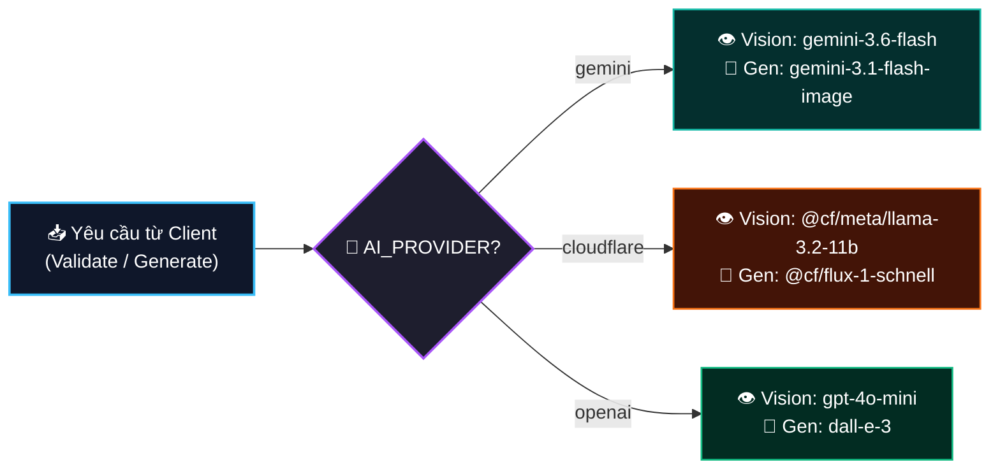
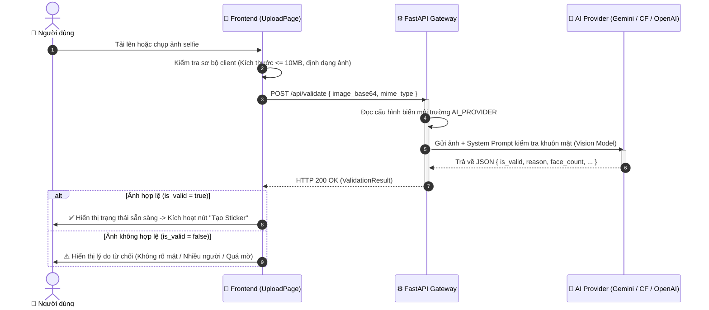

# Thiết kế Kiến trúc Phần mềm — Duhat Gen Sticker V1

## 0. Kiểm soát tài liệu

| Trường | Giá trị |
| --- | --- |
| Mã tài liệu | SAD-DGS-V1 |
| Phiên bản | 1.0 |
| Ngày chốt chuẩn | 18/08/2026 |
| Sản phẩm | Duhat Gen Sticker — ứng dụng web full-stack |
| Nguồn yêu cầu | `SRS_Sticker_Generation_V1_VI.md` v1.0 |
| Trạng thái | Đã chốt làm cơ sở triển khai |

Tài liệu phân biệt:

- **Hiện trạng:** mã nguồn đang tồn tại và có thể chạy/kiểm thử.
- **Mục tiêu V1:** kiến trúc bắt buộc trước khi phát hành theo SRS.

## 1. Tổng quan kiến trúc

### 1.1 Bối cảnh hệ thống

```mermaid
flowchart TB
    %% Class Definitions for High Contrast & Clean Aesthetics
    classDef clientStyle fill:#0f172a,stroke:#38bdf8,stroke-width:2px,color:#ffffff;
    classDef backendStyle fill:#1e1e2e,stroke:#a855f7,stroke-width:2px,color:#ffffff;
    classDef procStyle fill:#1c1917,stroke:#f59e0b,stroke-width:2px,color:#ffffff;
    classDef aiStyle fill:#0f172a,stroke:#ec4899,stroke-width:2px,color:#ffffff;
    classDef storageStyle fill:#022c22,stroke:#10b981,stroke-width:2px,color:#ffffff;

    subgraph CLIENT_BOX ["📱 Lớp Khách (Client Layer)"]
        FE["🎨 Frontend (Vite + React + TS)\nBrowser / Android WebShell"]:::clientStyle
        subgraph LOCAL_STORE ["💾 Client Storage (Local-Only)"]
            IDB[("IndexedDB\nduhat_stickers\n(Ảnh hoàn thiện)")]:::storageStyle
            LS[("localStorage\nduhat_sticker_packs\n(Metadata gói)")]:::storageStyle
        end
        FE <--> LOCAL_STORE
    end

    subgraph SERVER_BOX ["⚙️ Lớp Máy chủ (Backend Layer - FastAPI Port 8000)"]
        GATEWAY["🚪 API Gateway & SSE Router\n(main.py)"]:::backendStyle
        DISPATCH["🔀 Multi-Provider Dispatcher\n(Cấu hình qua AI_PROVIDER)"]:::backendStyle
        BG_REMOVER["✂️ Pipeline Tách nền & Viền trắng\n(rembg U-2-Net + PIL)"]:::procStyle
        
        GATEWAY --> DISPATCH
        GATEWAY --> BG_REMOVER
    end

    subgraph AI_BOX ["☁️ Nhà cung cấp AI (AI Cloud Providers)"]
        GEMINI["🌟 Gemini API\nVision (3.6) + Gen (3.1)"]:::aiStyle
        CF["⚡ Cloudflare Workers AI\nLLaMA 3.2 + FLUX.1"]:::aiStyle
        OAI["🤖 OpenAI API\nGPT-4o-mini + DALL-E 3"]:::aiStyle
    end

    %% Tương tác liên tầng
    FE -->|"1. POST /api/validate (Base64)"| GATEWAY
    FE -->|"2. POST /api/generate-pack (Base64)"| GATEWAY
    GATEWAY -.->|"3. Real-time SSE Stream (Từng sticker)"| FE

    DISPATCH --> GEMINI
    DISPATCH --> CF
    DISPATCH --> OAI

    style CLIENT_BOX fill:#090d16,stroke:#38bdf8,stroke-width:1px,stroke-dasharray: 4 4;
    style LOCAL_STORE fill:#061b14,stroke:#10b981,stroke-width:1px;
    style SERVER_BOX fill:#13111c,stroke:#a855f7,stroke-width:1px,stroke-dasharray: 4 4;
    style AI_BOX fill:#1a0b16,stroke:#ec4899,stroke-width:1px,stroke-dasharray: 4 4;
```



### 1.2 Nguyên tắc kiến trúc

1. PRD → SRS → Kiến trúc → Bàn giao/Danh sách công việc → TDD.
2. Frontend không bao giờ nhận thông tin xác thực AI provider hoặc khóa API.
3. FastAPI là ranh giới duy nhất giữa frontend và AI providers.
4. Ảnh nguồn chỉ tồn tại trong bộ nhớ tạm server — không lưu trữ bền vững phía backend.
5. AI provider có thể chuyển đổi qua biến `AI_PROVIDER` mà không thay đổi frontend.
6. Sticker đã tạo lưu trữ hoàn toàn phía client (IndexedDB), không upload lại server.
7. SSE streaming cho progressive UX — sticker hiển thị ngay khi mỗi slot hoàn thành.

## 2. Ngăn xếp công nghệ

### 2.1 Frontend

| Công nghệ | Phiên bản | Vai trò |
| --- | --- | --- |
| Vite | 6.x | Build tool + Dev server |
| React | 18.x | UI framework |
| TypeScript | 5.x | Type safety |
| JSZip | ^3.x | Xuất pack ZIP |
| FileSaver.js | ^2.x | Trigger download |
| Google Fonts (Inter) | — | Typography |

**Thư mục nguồn:**

```
frontend/src/
├── App.tsx                    # Root layout + wizard step router
├── index.css                  # Design tokens + global styles
├── main.tsx                   # Entry point
├── components/
│   ├── Header.tsx             # Branding header + back button
│   ├── LanguageToggle.tsx     # EN/VI language switcher
│   ├── StickerCard.tsx        # Sticker display: skeleton/loaded/selected states
│   ├── ConsentModal.tsx       # Photo ownership consent modal
│   ├── ReportModal.tsx        # Abuse/content reporting modal
│   └── CameraModal.tsx        # Camera capture modal with face guide
├── pages/
│   ├── LandingPage.tsx        # Hero intro page
│   ├── UploadPage.tsx         # Drag & drop / camera selfie uploader
│   ├── GeneratingPage.tsx     # SSE progress grid loader
│   ├── PreviewPage.tsx        # Pack selection + save
│   └── TrayPage.tsx           # Saved packs manager + ZIP exporter
├── services/
│   ├── api.ts                 # REST + SSE backend client
│   ├── storage.ts             # IndexedDB + localStorage persistence
│   ├── textCompositor.ts      # Canvas text overlay builder
│   └── analytics.ts           # In-memory analytics event tracking
├── i18n/
│   ├── i18n.ts                # i18n context + helper
│   ├── en.json                # English labels
│   └── vi.json                # Vietnamese labels
└── types/
    └── index.ts               # Domain interfaces + EXPRESSIONS config
```

### 2.2 Backend

| Công nghệ | Phiên bản | Vai trò |
| --- | --- | --- |
| Python | 3.11+ | Runtime |
| FastAPI | <1.0 | REST API framework |
| Uvicorn | latest | ASGI server |
| google-genai | latest | Gemini API client |
| rembg | latest | U-2-Net AI background removal |
| Pillow | latest | Image processing |
| NumPy/SciPy | latest | Image manipulation + morphology |
| python-dotenv | latest | Environment variable management |

**Thư mục nguồn:**

```
backend/
├── main.py                    # FastAPI app + SSE router + multi-provider dispatch
├── models.py                  # Pydantic schemas (ValidationRequest/Result, GenerateResult, etc.)
├── prompts.py                 # Chibi prompt template + EXPRESSIONS config + validation prompt
├── validators.py              # Server-side AI image validation (multi-provider)
├── bg_remover.py              # Multi-stage background removal pipeline
├── cloudflare_provider.py     # Cloudflare Workers AI adapter
├── openai_provider.py         # OpenAI API adapter
├── requirements.txt           # Python dependencies
└── .env.example               # Environment template
```

### 2.3 Android App (WebView wrapper)

```
android_app/
├── app/src/main/
│   ├── AndroidManifest.xml    # Permissions: INTERNET, READ_MEDIA_IMAGES
│   └── res/                   # Icons, themes, values
├── build.gradle.kts           # Compose + OkHttp + Coil + Navigation3
└── settings.gradle.kts
```

Ứng dụng Android bọc web app trong native shell. Sử dụng Jetpack Compose + OkHttp cho networking tương lai.

## 3. Kiến trúc AI Multi-Provider

### 3.1 Provider Selection

```
AI_PROVIDER env variable → "gemini" | "cloudflare" | "openai"
```

### 3.2 Luồng xử lý theo provider



### 3.3 Interface thống nhất

Cả 3 provider đều implement cùng interface:
- `call_*_validation(image_base64, mime_type, ...) → Dict[str, Any]`
- `call_*_generation(image_base64, mime_type, expression, ...) → str (base64)`

Backend `main.py` dispatch dựa trên `AI_PROVIDER` — frontend hoàn toàn không biết provider nào đang dùng.

## 4. Pipeline tạo Sticker

### 4.1 Luồng dữ liệu chi tiết

#### 4.1.1 Luồng tuần tự Xác thực ảnh Selfie (`/api/validate`)



#### 4.1.2 Luồng Tạo 8 Sticker song song & SSE Streaming (`/api/generate-pack`)

```mermaid
flowchart TD
    %% Styling tokens
    classDef client fill:#0f172a,stroke:#38bdf8,stroke-width:2px,color:#ffffff;
    classDef server fill:#1e1e2e,stroke:#a855f7,stroke-width:2px,color:#ffffff;
    classDef task fill:#18181b,stroke:#818cf8,stroke-width:1.5px,color:#ffffff;
    classDef ai fill:#27272a,stroke:#ec4899,stroke-width:1.5px,color:#ffffff;
    classDef post fill:#1c1917,stroke:#f59e0b,stroke-width:2px,color:#ffffff;
    classDef sse fill:#022c22,stroke:#10b981,stroke-width:2px,color:#ffffff;

    subgraph CLIENT_VIEW ["📱 Frontend (GeneratingPage)"]
        START_REQ["🚀 Gửi yêu cầu:\nPOST /api/generate-pack\n{ image_base64, mime_type }"]:::client
        STREAM_IN["✨ Nhận SSE Event\n(Render sticker ngay lập tức vào từng slot)"]:::client
    end

    subgraph SERVER_PIPELINE ["⚙️ Backend Processing (FastAPI)"]
        DISPATCH_TASKS["⚡ Khởi tạo 8 asyncio Tasks song song\n(1 task cho mỗi biểu cảm)"]:::server

        subgraph PARALLEL_TASKS ["🔀 8 Tác vụ sinh ảnh độc lập (asyncio.as_completed)"]
            direction LR
            T1["Slot 1:\nVui vẻ"]:::task
            T2["Slot 2:\nCười to"]:::task
            T3["Slot 3:\nThả tim"]:::task
            TDOTS["... 4 Slots\nkhác ..."]:::task
            T8["Slot 8:\nNgạc nhiên"]:::task
        end

        subgraph AI_ROUTER ["🤖 Multi-Provider Image Generation (AI_PROVIDER)"]
            AI_CALL["Sinh ảnh Chibi Sticker\n(Gemini 3.1 / FLUX.1 / DALL-E 3)"]:::ai
        end

        subgraph POST_PROCESS ["✂️ Pipeline Hậu kỳ ảnh (bg_remover.py)"]
            direction TB
            RAW["1. Nhận ảnh thô từ AI (Raw Base64)"]
            CUTOUT["2. Tách nền AI (rembg U-2-Net / Fallback)"]
            BORDER["3. Phủ viền trắng sắc nét (Die-Cut Border)"]
            RAW --> CUTOUT --> BORDER
        end

        SSE_GEN["📡 Đóng gói SSE Event:\n{ slot_index, expression, sticker_base64, status: 'done' }"]:::sse
    end

    %% Luồng liên kết
    START_REQ --> DISPATCH_TASKS
    DISPATCH_TASKS --> T1 & T2 & T3 & TDOTS & T8
    T1 & T2 & T3 & TDOTS & T8 --> AI_CALL
    AI_CALL --> RAW
    BORDER --> SSE_GEN
    SSE_GEN -.->|"Stream realtime từng slot về client"| STREAM_IN

    class RAW,CUTOUT,BORDER post;
    style CLIENT_VIEW fill:#090d16,stroke:#38bdf8,stroke-width:1px,stroke-dasharray: 4 4;
    style SERVER_PIPELINE fill:#13111c,stroke:#a855f7,stroke-width:1px,stroke-dasharray: 4 4;
    style PARALLEL_TASKS fill:#181824,stroke:#818cf8,stroke-width:1px;
    style AI_ROUTER fill:#1f1322,stroke:#ec4899,stroke-width:1px;
    style POST_PROCESS fill:#241a10,stroke:#f59e0b,stroke-width:1px;
```



### 4.2 Background Removal Pipeline (bg_remover.py)

```mermaid
flowchart TD
    classDef input fill:#0f172a,stroke:#38bdf8,stroke-width:2px,color:#ffffff;
    classDef stage1 fill:#1e1e2e,stroke:#a855f7,stroke-width:1.5px,color:#ffffff;
    classDef decision fill:#312e81,stroke:#818cf8,stroke-width:2px,color:#ffffff;
    classDef fallback fill:#451a03,stroke:#f59e0b,stroke-width:1.5px,color:#ffffff;
    classDef stage4 fill:#1c1917,stroke:#fbbf24,stroke-width:1.5px,color:#ffffff;
    classDef output fill:#022c22,stroke:#10b981,stroke-width:2px,color:#ffffff;

    IN(["📥 Ảnh Raw từ AI Provider (Base64)"]):::input

    subgraph S1 ["Stage 1: rembg U-2-Net AI Cutout"]
        S1_RUN["Tách nền bằng mô hình U-2-Net"]:::stage1
        S1_PRESERVE["_preserve_interior_alpha()\nBảo toàn mắt, răng và chi tiết trắng bên trong"]:::stage1
        S1_CHECK{"_check_cutout_validity()\nOpaque pixels nằm trong [5% - 92%]?"}:::decision
        S1_RUN --> S1_PRESERVE --> S1_CHECK
    end

    subgraph S2 ["Stage 2: Edge-Connected Flood Fill (Fallback)"]
        S2_RUN["Lấy mẫu 4 góc ảnh\nConnected-component labeling\nChỉ xóa vùng nền thông với viền ngoài"]:::fallback
    end

    subgraph S3 ["Stage 3: Fail-Safe"]
        S3_RUN["Giữ nguyên ảnh gốc nếu cả 2 stage lỗi"]:::fallback
    end

    subgraph S4 ["Stage 4: Thêm viền trắng Sticker (Die-Cut Border)"]
        S4_DILATE["1. Nở rộng mặt nạ viền ngoài (MaxFilter)"]:::stage4
        S4_BLUR["2. Khử răng cưa viền (GaussianBlur)"]:::stage4
        S4_COMPOSITE["3. Ghép nhân vật lên nền viền trắng"]:::stage4
        S4_DILATE --> S4_BLUR --> S4_COMPOSITE
    end

    OUT(["🎉 Sticker PNG hoàn chỉnh\n(Nền trong suốt + Viền trắng sắc nét)"]):::output

    IN --> S1_RUN
    S1_CHECK -- "✅ Đạt chuẩn" --> S4_DILATE
    S1_CHECK -- "❌ Mất hình / Quá mờ" --> S2_RUN
    S2_RUN -- "Thành công" --> S4_DILATE
    S2_RUN -- "Thất bại" --> S3_RUN
    S3_RUN --> S4_DILATE
    S4_COMPOSITE --> OUT

    style S1 fill:#13111c,stroke:#a855f7,stroke-width:1px;
    style S2 fill:#1f1309,stroke:#f59e0b,stroke-width:1px;
    style S3 fill:#1f1309,stroke:#f59e0b,stroke-width:1px;
    style S4 fill:#241a10,stroke:#fbbf24,stroke-width:1px;
```



## 5. Lưu trữ Client-Side

### 5.1 IndexedDB (`duhat_stickers`)

- **Database name:** `duhat_stickers`
- **Object Store:** `images` (key-value: sticker_id → base64 blob)
- **Version:** 1

### 5.2 localStorage (`duhat_sticker_packs`)

```typescript
interface StickerPack {
  id: string;           // "pack_{timestamp}"
  createdAt: string;    // ISO 8601
  stickers: Sticker[];  // imageBase64 = "" (chỉ metadata, blob ở IndexedDB)
}
```

### 5.3 Lifecycle

| Thao tác | IndexedDB | localStorage |
| --- | --- | --- |
| Save Pack | PUT blob per sticker | Push pack metadata (imageBase64 cleared) |
| Load Tray | GET blob by id | Read all packs |
| Delete Sticker | DELETE blob | Remove from pack stickers array |
| Delete Pack | DELETE all blobs | Remove pack entry |

## 6. Internationalization (i18n)

### 6.1 Kiến trúc

- `LanguageContext` (React Context) cung cấp `language` + `setLanguage` toàn app.
- Helper `t(key, language, params?)` tra cứu từ `en.json` / `vi.json`.
- Hỗ trợ template interpolation: `{current}`, `{total}`, `{count}`.

### 6.2 Phạm vi bao phủ

- UI labels: buttons, headings, instructions, error messages.
- Expression names: `exp_happy`, `exp_laughing`, ... (8 biểu cảm).
- Report categories: 4 danh mục vi phạm.

## 7. Bảo mật và Quyền riêng tư

### 7.1 Ranh giới dữ liệu

| Dữ liệu | Nơi tồn tại | Thời hạn |
| --- | --- | --- |
| Ảnh gốc (base64) | Bộ nhớ tạm server (xử lý) | Chỉ trong thời gian request |
| Ảnh sticker đầu ra | IndexedDB phía client | Cho tới khi người dùng xóa |
| Pack metadata | localStorage phía client | Cho tới khi người dùng xóa |
| API keys | .env file server-side | Vĩnh viễn (không commit) |
| Analytics events | In-memory phía client | Mất khi refresh page |

### 7.2 Kiểm soát truy cập

- CORS: cho phép `http://localhost:5173` và wildcard (dev).
- API keys không bao giờ gửi tới frontend.
- Không có authentication/session phía frontend trong V1 (lưu trữ hoàn toàn local).

### 7.3 Dữ liệu nhạy cảm

- Analytics/log không chứa: base64 ảnh, tên file, đường dẫn, URL, prompt thô.
- Server log chỉ ghi: expression_id, base64 length, success/error status.

## 8. Triển khai và Vận hành

### 8.1 Phát triển cục bộ

```bash
# Backend
cd backend
pip install -r requirements.txt
uvicorn main:app --reload --port 8000

# Frontend
cd frontend
npm install
npm run dev    # http://localhost:5173
```

### 8.2 Biến môi trường

```bash
# Bắt buộc
AI_PROVIDER=gemini          # "gemini" | "cloudflare" | "openai"
GEMINI_API_KEY=AIzaSy...    # Khi AI_PROVIDER=gemini

# Tùy chọn
ENABLE_BG_REMOVAL=true      # Bật/tắt rembg
CF_ACCOUNT_ID=...           # Khi AI_PROVIDER=cloudflare
CF_API_TOKEN=...
OPENAI_API_KEY=...          # Khi AI_PROVIDER=openai
```

### 8.3 Android App

- Package: `com.example.duhatstickerai`
- Min SDK: 24, Target SDK: 36
- Build: Gradle + Kotlin + Jetpack Compose
- Networking: OkHttp 4.12.0 + SSE
- Image Loading: Coil Compose 2.6.0

## 9. Hiệu năng và Tối ưu

### 9.1 Frontend

- Skeleton loading cho tất cả sticker slots.
- Progressive rendering: mỗi sticker hiện ngay khi SSE event đến.
- Lazy loading sticker blob từ IndexedDB khi mở Tray.
- Canvas text compositing phía client (không cần server round-trip).

### 9.2 Backend

- `asyncio.as_completed()` cho 8 tác vụ song song — tận dụng tối đa throughput.
- `asyncio.to_thread()` wrap blocking AI calls.
- SSE streaming tránh long-polling/timeout.
- rembg model tải 1 lần, cache trong process.

### 9.3 Mục tiêu hiệu năng

| Chỉ số | Mục tiêu |
| --- | --- |
| Thời gian validation | < 5 giây |
| Thời gian tạo 8 sticker (song song) | < 120 giây |
| Thời gian tách nền/sticker | < 10 giây |
| Kích thước app bundle (frontend) | < 500 KB gzipped |
